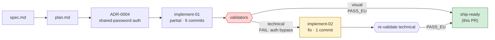

# Open-PR body template

The skeleton `/open-pr` fills in. Substitute every `{{double-brace}}`
placeholder; omit a section entirely when its source doesn't exist (no
empty `<details>` shells — silence is information). The standard at
[`standard.md`](./standard.md) explains *why* each section sits at the level
it does; this template gives the *what*.

The PR title is generated separately, as `feat({{scope}}): {{subject}}`,
per [`commitlint.config.js`](../../../commitlint.config.js).

---

```markdown
## Summary

{{1–3 sentences. The *why* + the *what* in one breath. Sourced from
spec.md § "Pourquoi" + the feature's headline result.}}

## Validation

- Visual:    {{PASS | PASS_EXCEPT_UNVERIFIABLE (N) | FAIL}} — [report](docs/features/{{app}}/{{slug}}/validation/visual-validation-{{ts}}.md)
- Technical: {{PASS | PASS_EXCEPT_UNVERIFIABLE (N) | FAIL}} — [report](docs/features/{{app}}/{{slug}}/validation/technical-validation-{{ts}}.md)

## Orchestration trace

{{One-line level-1 summary — counters that tell the reviewer at-a-
glance how messy the build was. Example:

  *Built in 2 implementation rounds + 2 validation rounds, 1 defect
  caught by the technical-validator (auth bypass on rotate-password),
  fix landed in round 2, 6 kaizen items queued for post-merge sweep.*}}

<details><summary>Flow diagram + per-stage results</summary>



{{Render the diagram from `runs/<run-id>/journal.md.jsonl`: one node
per dispatched sub-agent (implementation / technical-validation /
visual-validation), with edge labels carrying the verdict.
`fail` class for FAIL verdicts, `fix` class for retry rounds, `ok`
class for ship-ready / PASS final nodes.}}

| Round | Agent | Output | Verdict | Commits | Notes |
|---|---|---|---|---|---|
{{One row per dispatched agent, in chronological order. Pull
`status`, `summary` (first sentence), `sha` from the agent's verdict
YAML at `runs/<run-id>/agents/<agent>-<NN>.md`. Mark retries as
"fix round 1", "fix round 2", etc.}}

**Run state:** [`docs/features/{{app}}/{{slug}}/runs/{{run-id}}/`]({{path}}) — journal, per-agent verdicts, state checkpoint.

</details>

## Architecture choices

{{One bullet per ADR referenced by the diff or the plan. Level 1 line =
chosen path + one-line "why". Level 2 toggle = Decision + Consequences.
Level 3 toggle (nested) = Alternatives + Evaluation rubric +
Implementation pointers.}}

- **{{ADR-NNNN: chosen path}}.** {{One-line why.}}

  <details><summary>Rationale (consequences, costs)</summary>

  {{ADR's *Decision* paragraph + *Consequences* bullets, verbatim.}}

  </details>

  <details><summary>Alternatives considered (criteria, evaluation)</summary>

  {{ADR's *Alternatives considered* sub-sections, verbatim.}}

  {{ADR's *Evaluation rubric* + comparison matrix, verbatim.}}

  <details><summary>Implementation pointers</summary>

  {{ADR's *Implementation pointers* block, verbatim.}}

  </details>
  </details>

<!-- Repeat one bullet per ADR. -->

## What the user sees / does

{{Spec-driven walk of the user-visible changes. Level 1 = bullet list
sourced from spec.md § "Result" / § "Q.O.D."; level 2 = the spec sub-
sections verbatim.}}

- {{capability — short, present-tense}}.

  <details><summary>Spec §{{anchor}}</summary>

  {{Spec sub-section, verbatim.}}

  </details>

## Visual evidence

{{Embedded screenshot block. SHA-pinned raw blob URLs — the generator
in `.claude/skills/visual-validation/SKILL.md` produces these.}}


<details><summary>Mobile + edge cases ({{N}} screenshots)</summary>

<!-- More embedded raw blob URLs -->

</details>

## Test plan

{{Manual smoke checklist a reviewer ticks on the preview deploy. 3–6
items.}}

- [ ] {{Manual check 1}}
- [ ] {{Manual check 2}}
- [ ] {{Manual check 3}}

<details><summary>Automated gates (run on CI)</summary>

- `pnpm --filter {{app_pkg}} run test:core` → {{N}} tests, 100/100/100/100 perFile on `*.core.ts` + `*.utils.ts`.
- `pnpm --filter {{app_pkg}} run test`      → {{N}} tests over Postgres.
- `pnpm --filter {{app_pkg}} run typecheck` → clean.
- `pnpm --filter {{app_pkg}} run lint`      → clean.
- `pnpm exec knip`                          → clean.

</details>

<details><summary>What changed (diffstat)</summary>

| Folder | Lines | Purpose |
|---|---|---|
{{table rows from `git diff origin/main --stat | grep apps/`}}

`git log origin/main..HEAD --oneline`:
```
{{compact log}}
```

</details>

<!-- ## Validation gaps (only when PASS_EXCEPT_UNVERIFIABLE) -->
<!-- ## Dantotsus uncovered (only when entries exist on the branch) -->
<!-- ## Known gaps & follow-ups (only when intentionally deferred) -->

---

https://claude.ai/code/session_{{session_id}}
```

---

## Section-by-section sourcing map

| Section | Source | Verbatim? |
|---|---|---|
| Summary | `spec.md` § *Pourquoi* + headline result | near-verbatim |
| Validation verdicts | latest report files under `validation/` | yes |
| Orchestration trace | `runs/<run-id>/state.json` + `journal.md.jsonl` + `agents/*.md` | computed |
| Architecture choices | `docs/adr/NNNN-*.md` (each referenced ADR) | yes |
| What the user sees / does | `spec.md` § *Result* (visible / behaviour) | yes |
| Visual evidence | `validation/visual-validation-<ts>/*.png` | n/a (binary) |
| Test plan checklist | `spec.md` § *Test strategy* (validation-visual rows) | near-verbatim |
| Automated gates | `package.json` scripts + last gate run output | computed |
| Diffstat | `git diff origin/main --stat` | computed |
| Validation gaps | UNVERIFIABLE rows from validation reports | yes |
| Dantotsus uncovered | `docs/dantotsus/*.md` created since base ref | near-verbatim |
| Known gaps & follow-ups | operator-supplied bullets | operator authored |

## Rendering rules

- **Hide empty toggles.** If a section's source produces nothing, drop
  the whole section (heading + toggle). Empty `<details>` boxes are
  noise.
- **SHA-pin screenshots before opening the PR.** The skill rewrites the
  `## Visual evidence` block once the user approves the draft, using
  `git rev-parse HEAD` to pin URLs.
- **Length cap.** Targets:
  - Level 1 cumulative < 60 lines (a reviewer reads this in 30 seconds).
  - Each level-2 toggle ≤ 30 lines. If longer, split into nested level-3
    toggles.
- **No prose at level 3.** Level 3 carries raw evidence (code, screenshots,
  matrices, commit hashes). If the reviewer needs sentences, the section
  belongs at level 2.
- **One backlink at the foot.** The
  `https://claude.ai/code/session_<id>` trailer is the only forced line;
  everything else is operator-controlled.
