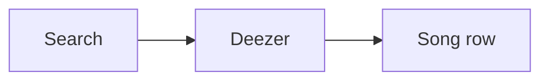

# A title that names what changed

One paragraph a reviewer reads before deciding whether to open anything else.

## Flow


```mermaid
flowchart LR
  search[Search] --> deezer[Deezer]
  deezer --> song[Song row]
```

## Decisions

| Decision | Alternative | Why | Consequences | ADR |
| --- | --- | --- | --- | --- |
| What was chosen | What was not | What made the difference | What the reader now lives with | [ADR-0017](../../../docs/adr/0017-a-slug.md) |

## Before merge

### What the operator does first

The state the branch is in until this runs, and what stays broken without it.

```sh
aws ssm put-parameter --name /example --value literal --region eu-west-3
```

## Validation

### What was checked

How it was checked and what came back.

## Notable

- A fact a reviewer would otherwise have to discover by reading the diff.
