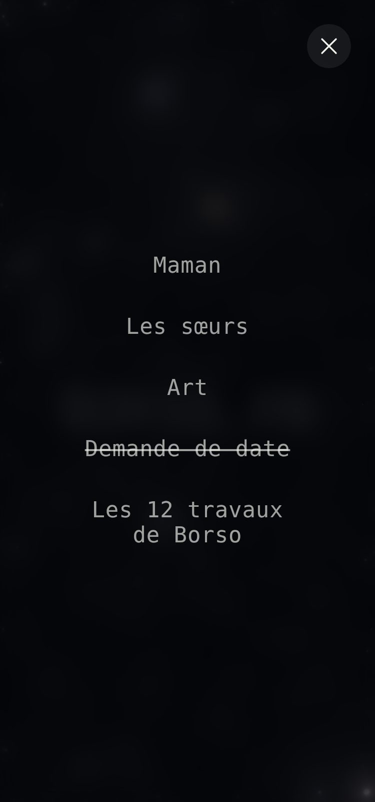
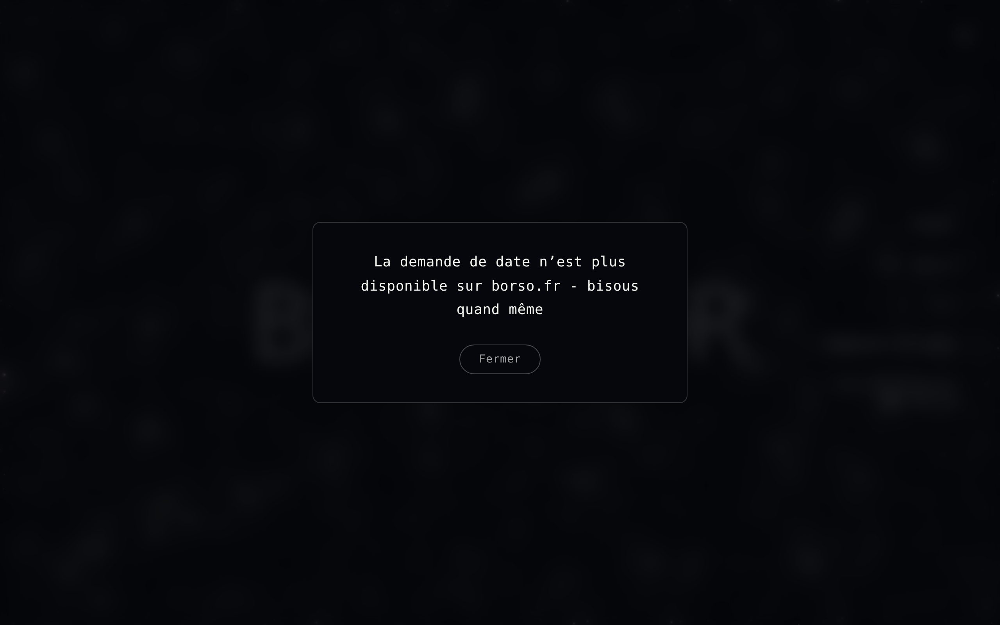
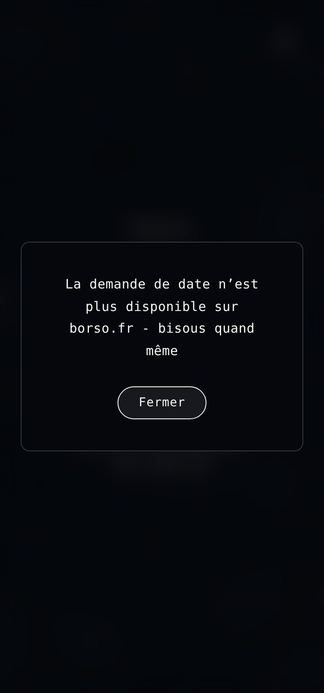

# Deprecated date request — screenshot evidence

Captured on the Vite dev server at commit `0fc416c`, viewports 1280px and 375px.

## Menu — entry struck through

### Desktop (1280px)

### Mobile (375px)

## Dialog on click

### Desktop (1280px)

### Mobile (375px)

