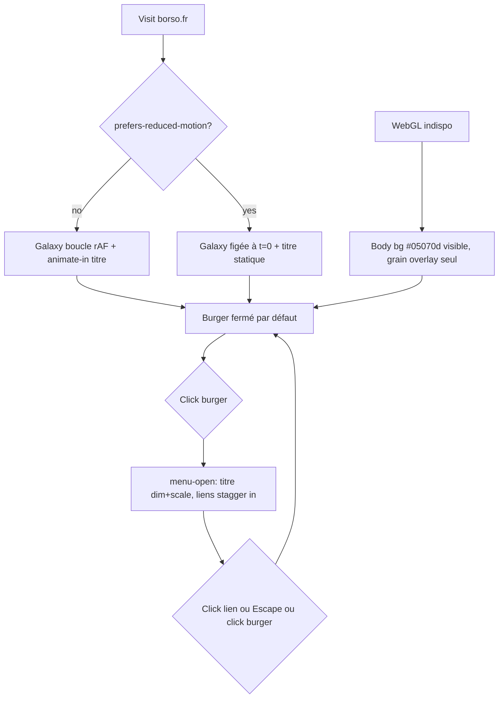

# Redesign de la front page borso.fr — galaxie WebGL + Major Mono Display

## Perspectives confronted

- [x] **Client / business** — Hugo (solo dev, c'est aussi le client). Valeur = identité visuelle qui reflète Hugo (sports, musique, art, espace, science) plutôt qu'un site générique. Pas de revenu, pas de KPI marketing.
- [x] **Product** — invocation = visite de `https://borso.fr`. Le contenu (5 liens nav + titre + welcome) ne change pas ; le redesign est purement visuel.
- [x] **Tech-lead** — challengé dans Q.O.D. ci-dessous (fallback WebGL, reduced-motion, mobile perf, build pipeline, source du shader).
- [x] **Developer** — fichiers listés sous *Changes / Files*, port React → vanilla nommé. Pas de toolchain ajoutée (`apps/borso-fr` reste plain HTML/CSS/JS servi par `python3 -m http.server`).
- [x] **Designer** — itéré dans `spec/design-chat-transcript.md` (recadrages successifs de Hugo : "ce n'est pas un site de pub", "pas besoin des Tweaks", choix de la police "Major caps geo"). Le prototype final est `spec/design-prototype.html`.

## Why

Le site `borso.fr` actuel est fonctionnel mais sans personnalité — gradient de points colorés bouncy + Space Mono. Hugo veut une identité visuelle qui lui ressemble (espace, contemplation, posé) et qui survit à un an sans être ré-écrite parce qu'on s'en lasse. Le redesign garde *exactement* le même contenu (5 liens, "Bienvenue sur borso.fr") et change uniquement la *forme*.

- **Output metric (lagging, qualitative)** : Hugo ne demande pas de re-redesign dans les 12 mois. Mesure : c'est une métrique humaine ("je continue de l'aimer"), pas instrumentée. Pas de tracking sur un site perso.
- **Input metrics (leading, machine-observables)** :
  1. **Aucune erreur console** sur la golden path (galaxy se rend, fonts chargent, burger toggle marche, escape ferme).
  2. **LCP ≤ 2.5 s** sur connexion 4G simulée + DPR=2 (le titre `borso.fr` doit s'afficher avant la galaxie complète).
  3. **CLS = 0** (pas de layout shift quand la galaxie ou les polices arrivent).
  4. **INP ≤ 200 ms** sur le toggle burger.
- **Gemba** : la conversation `design-chat-transcript.md` est le terrain. Hugo a recadré deux fois ("ce n'est pas un site de pub", "remets le contenu d'origine"), choisi la police par expérimentation (11 → 15 propositions), et fixé l'apparence du burger (titre dim+scale 0.94 quand menu ouvert pour éviter la collision visuelle).

## Result

Page unique servie à `https://borso.fr/` (et `http://localhost:5173/` en dev) :

- **Fond plein écran** : galaxie WebGL (4 couches de parallax + twinkle + repulsion souris). Voir `spec/design-shader-bg.js` — le shader est porté tel quel.
- **Overlay** : SVG noise grain (mix-blend-mode: overlay, opacity 0.12).
- **Centre** : "Bienvenue sur" (Space Mono, 14–20 px) + "borso.fr" (Major Mono Display, 56–168 px responsive).
- **Top-right** : burger button (44 × 44 px). Au clic : transforme en croix, ouvre le menu vertical à droite, ajoute `body.menu-open` qui dim/scale le titre (`opacity: .32; transform: scale(.94)`).
- **Menu ouvert** : 5 liens alignés à droite (Maman / Les sœurs / Art / Demande de date / Les 12 travaux de Borso), staggered reveal 80 + i×60 ms, underline sweep au hover.
- **Mobile (< 640 px)** : menu prend tout l'écran (centré, backdrop-blur), font-size 22 px.

Référence visuelle complète : `spec/design-prototype.html` (rendu pixel-perfect cible).

## Use cases / edge cases



**Happy path numéroté :**
1. Utilisateur arrive sur `borso.fr`.
2. Le titre `borso.fr` apparaît avec fade-up (1.2 s, ease-out, delay 0.5 s).
3. La galaxie s'anime en boucle (rAF).
4. Utilisateur clique sur le burger ; le menu s'ouvre, le titre dim/scale.
5. Utilisateur clique sur "Art" ; navigation vers `art/mondrian/`.

**Edge cases :**
- `prefers-reduced-motion: reduce` actif → la galaxie reste figée à t=0 (pas de rAF, premier drawArrays synchrone suffit), pas de fade-up sur le titre, pas de smoothing souris.
- WebGL indisponible → `init()` du shader early-return ; on voit le `body { background: #05070d }` plus le grain. Pas de fallback gradient — le minimalisme est OK.
- Onglet caché au chargement → `animate-in` n'est ajouté que sur `pageshow` avec `visibilityState !== 'hidden'`. Sans ça, le titre est `opacity:1` par défaut (jamais bloqué à 0).
- ResizeObserver indisponible → fallback sur `window resize` uniquement (le shader le gère déjà).

**Error cases :**
- Polices Google Fonts qui timeout → `font-display: swap` montre Space Mono / system mono en attendant. Pas de fallback custom.
- Erreur de compilation shader → log console + early-return. Le site reste utilisable (titre + liens visibles sur fond noir).

## Questions, Options and Decisions

| Question | Options | Decision (2026-05-14) |
| --- | --- | --- |
| État par défaut du burger menu ? | (a) ouvert (design React, useState(true)) (b) fermé (site actuel) (c) conditionnel viewport | **(b) Fermé par défaut.** Continuité avec `borso.fr` actuel ; le titre est plein à l'arrivée, le menu se découvre. Le `useState(true)` du prototype était une commodité du design tool. |
| `prefers-reduced-motion` ? | (a) respecter (galaxie figée, pas de fade-up) (b) ignorer (c) fallback gradient | **(a) Respecter.** Accessibilité + perf appareils faibles. Implémentation (corrigée 2026-05-14T13h+ par ADR 0003) : passer `disableAnimation={matchMedia('(prefers-reduced-motion: reduce)').matches}` au composant `<Galaxy />`, qui freeze son rAF interne ; côté CSS, désactiver les keyframes via media query. |
| Stratégie perf mobile ? | (a) identique (b) DPR/density réduits (c) pas de shader | **(a) Identique au desktop.** Le composant Galaxy gère son sizing via `Renderer.setSize`. Si les retours utilisateurs montrent un problème, raffiner via une PR `kaizen`. |
| Police du titre ? | Itération longue dans le chat (11 → 15 propositions) | **Major Mono Display (caps geo)** — choix de Hugo dans le chat. Importé via Google Fonts `family=Major+Mono+Display`. |
| Fallback WebGL ? | (a) gradient CSS (b) image PNG (c) rien (body bg) | **(c) Rien.** Si `ogl` ne peut pas obtenir un contexte WebGL, le composant Galaxy ne monte rien ; le `body { background: #05070d }` + grain suffit visuellement. Minimaliste, zéro asset à maintenir. |
| Source du shader ? | (a) react-bits installé via `pnpm add ogl` + composant React copié (b) vanilla WebGL forké du design (c) écrire à partir de zéro | **(a) react-bits comme composant React + ogl npm.** Décision **corrigée** le 2026-05-14 — ADR 0003 supersedes ADR 0002. La décision initiale (vendoring vanilla) était motivée par "éviter de forcer Vite + React" — prémisse invalidée par cat'ing `apps/borso-fr/package.json` (Vite + React 19 déjà en place pour `art/mondrian`). Le composant est copié dans `apps/borso-fr/site/components/Galaxy.tsx`, monté par `apps/borso-fr/site/galaxy.tsx` sur `#bg-canvas-wrap`. Attribution MIT (David Haz) en tête du fichier. Dantotsu pour le défaut de cross-check : [`believed-the-bundle-readme-not-the-live-package-json.md`](../../../../dantotsus/believed-the-bundle-readme-not-the-live-package-json.md). |
| Tweaks panel ? | (a) garder (b) supprimer | **(b) Supprimé.** Hugo confirmé dans le chat : "pas besoin de mettre les settings de galaxy dans les tweaks, ils sont bien comme ça". Les paramètres sont gelés en haut de `galaxy.tsx` (le mount entry). |
| Tracking analytics ? | (a) Plausible / GA (b) rien | **(b) Rien.** Site perso, pas de RGPD-consent flow. Métriques Web Vitals via `web-vitals` non-instrumentées (on les regarde via Lighthouse manuellement si besoin). |
| Build pipeline ? | (a) introduire Vite (b) garder `cp -R site dist` | **Déjà sur Vite.** Décision **corrigée** le 2026-05-14 — le brief Claude Design parlait de `cp -R site dist` mais `apps/borso-fr/package.json` a `"build": "vite build"` depuis deux PRs (consommé par `art/mondrian`). Pas de toolchain à introduire ; on consomme l'existant. Voir le dantotsu cité ci-dessus pour le cross-check qui aurait dû fire. |
| Test runner pour borso-fr ? | (a) ajouter Vitest pour les utils (b) skipper | **Déjà sur Vitest.** Décision **corrigée** le 2026-05-14 — `apps/borso-fr/package.json` a Vitest + coverage-v8 (consommé par `art/mondrian/painting.utils.test.ts` et `keyboard.utils.test.ts`). Aucune util pure n'émerge dans cette PR — pas de nouveau `*.utils.ts`. Si une util pure apparaît plus tard, on l'ajoute avec son `*.utils.test.ts` au runner existant. |

**Out of scope :**
- Mise à jour des sous-pages (`family/mom.html`, `family/les-filles.html`, `art/mondrian/`). Elles continuent d'exister comme aujourd'hui.
- Tweaks panel / contrôles galaxie côté utilisateur.
- Mode sombre/clair toggle (la page est dark par essence).
- Tracking / analytics.
- Internationalisation (le contenu est en français, point).

## Changes

### Types / domain model

Aucun — pas d'entité, pas de modèle métier.

### Database changes

Aucun.

### Files to change

```
apps/borso-fr/package.json            # UPDATE — `pnpm --filter @borso-app/borso-fr add ogl` (ajoute ogl en dependencies)
apps/borso-fr/site/index.html         # UPDATE — nouvelle structure (bg-canvas-wrap, grain, stage, burger, nav, scripts type=module en ordre).
apps/borso-fr/site/style.css          # UPDATE — full rewrite. Variables CSS, font Major Mono Display, grid centré, burger + menu, reduced-motion media query, responsive < 640 px.
apps/borso-fr/site/script.js          # UPDATE — port vanilla de landing.jsx : burger toggle, Escape ferme, body.menu-open, staggered transitionDelay sur les <li>, animate-in sur pageshow visible.
apps/borso-fr/site/galaxy.tsx         # NEW — entry React qui mount <Galaxy {...PARAMS} disableAnimation={prefersReducedMotion} /> sur #bg-canvas-wrap via createRoot.
apps/borso-fr/site/components/Galaxy.tsx  # NEW — port TSX du composant react-bits Galaxy (MIT, David Haz, attribution préservée).
apps/borso-fr/site/components/Galaxy.css  # NEW — .galaxy-container { position:absolute; inset:0; width:100%; height:100%; display:block }

apps/borso-fr/site/shader-bg.js       # DELETED — ADR 0002 superseded par ADR 0003.

docs/features/borso-fr/front-page-redesign/spec/spec.md           # ce fichier (Q.O.D. corrigés)
docs/features/borso-fr/front-page-redesign/spec/design-*           # 4 fichiers de référence copiés depuis le bundle Claude Design
docs/adr/0002-vendor-react-bits-galaxy-shader.md                   # marqué superseded
docs/adr/0003-react-bits-galaxy-as-react-component.md              # NEW
docs/dantotsus/believed-the-bundle-readme-not-the-live-package-json.md  # NEW — racine du défaut détecté
.claude/skills/specification/standard.md                            # éradication (level 2)
.claude/skills/technical-conception/standard.md                     # éradication (level 2)
```

Pas de changement `apps/borso-fr/package.json` (pas de nouvelle dépendance). Pas de changement `bin/app.ts` ou CDK (le `StaticSite` route le `dist/` qui contient tout le `site/`).

### Test strategy

> Petite feature, surface UI ; les deux validators autonomes couvrent l'intégralité.

- **`/visual-validation`** — couvre :
  - HP1 : titre `borso.fr` visible, fond galaxie animé.
  - HP2 : font Major Mono Display chargée (snapshot CSS computed value du titre).
  - HP3 : burger toggle ouvre le menu, `body` reçoit `menu-open`, titre dim+scale visible.
  - HP4 : Escape ferme le menu.
  - HP5 : Liens cliquables, hrefs corrects (5 liens : Maman, Les sœurs, Art, Demande de date, Les 12 travaux de Borso).
  - Edge : viewport < 640 px → menu plein écran centré.
  - Edge : `prefers-reduced-motion: reduce` (émulé via `agent-browser set device`) → pas d'animation perçue.
  - Edge : WebGL désactivé (Chrome flag) → page reste fonctionnelle, fond uni.
  - Vérification broken-image scan (cf. `/visual-validation` standard) sur toutes les screenshots.
- **`/technical-validation`** — couvre :
  - Aucune trace de React / Babel / JSX / `react-bits` import dans le diff (le port doit être vanilla).
  - Aucun usage de `as Foo` (biome plugin), aucun `any`, `noUncheckedIndexedAccess` propre sur tout nouveau TS si introduit (mais ce PR n'introduit pas de TS).
  - `apps/borso-fr/site/shader-bg.js` porte l'attribution MIT (David Haz, react-bits) en tête.
  - Pas de duplication de logique entre `script.js` et `shader-bg.js`.
  - Le `index.html` charge les scripts dans l'ordre : `shader-bg.js` (load defer ou en bas), puis `script.js`.
- **Pas de `*.utils.ts` ⇒ pas de gate coverage** (le code est purement side-effect : DOM, WebGL, événements).
- **Pré-flight gate** (manuel pour cette feature, par l'implementer) : `pnpm --filter @borso-app/borso-fr run dev` et ouvrir `http://localhost:5173/` ; screenshot self-check + scan broken-image.

## Production strategy

### Analytics

Aucune. Site perso, pas de tracking. Si plus tard Hugo veut Web Vitals ↑↓, ce sera une PR à part (`feat(borso-fr): web-vitals reporting`).

### Zero-defect strategy

Pas de classes d'erreur nommées (pas de back-end). Les garde-fous sont structurels :

- **WebGL indisponible** : `init()` early-return, body bg + grain reste visible.
- **Erreur compilation shader** : log console + early-return, identique au cas précédent.
- **Polices qui timeout** : `font-display: swap` rend la fallback monospace immédiatement.
- **Animation-fill-mode: both** sur les keyframes — le titre est visible même si l'animation ne déclenche pas (onglet caché, etc.).
- **Onglet caché au chargement** : `animate-in` ajouté sur `pageshow` only-if-visible. Évite le titre bloqué à `opacity:0`.

Pas de Sentry, pas d'alerting. Le post-deploy smoke check (Hugo visite `https://borso.fr` après merge prod) est suffisant pour un site perso.
