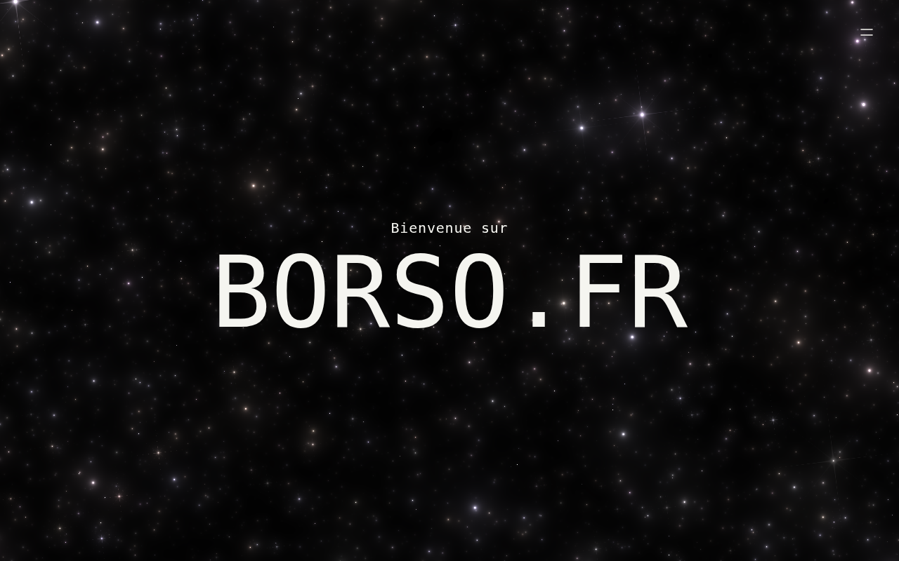
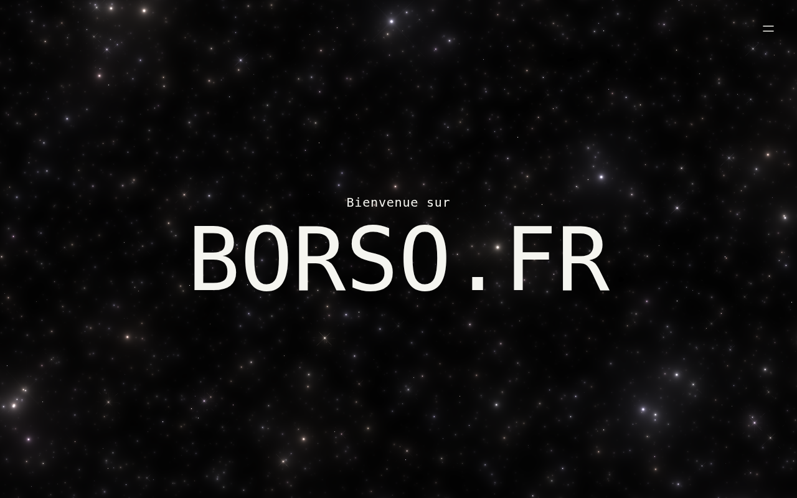

# Lightspeed jump — browser evidence

Captured on the Vite dev server in Chromium at 1280×800, on the landing page.

**A still cannot show this effect.** The jump is the galaxy's own travel rate
taken up, so what changes is how fast the stars sweep past, and a frozen frame
has no speed in it. The pair below shows the two things a still *can* carry —
the field gets denser as the layers cycle faster, and the glow ramp lengthens
the rays on each star — and everything else has to be watched on the preview.

The second frame was taken by pinning the jump at its last millisecond, so it
is the top of the acceleration rather than a frame caught somewhere along it.

## Cruising

## At the top of the jump

