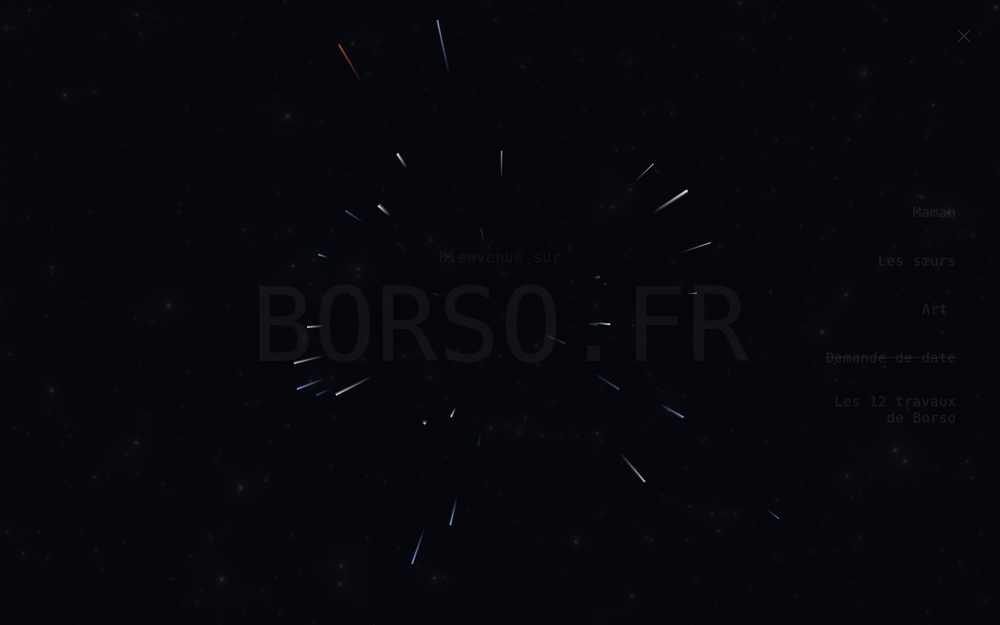

# Lightspeed jump — browser evidence

Captured on the Vite dev server in Chromium at 1280×800, on the landing page,
clicking the menu entry for the twelve labours.

The animation is 820 ms long and the container renders the WebGL galaxy in
software, so a real-time screenshot lands wherever the compositor happens to
be. Each frame below was taken by pausing every running animation and setting
its `currentTime`, which makes the moment named in the caption the moment
actually drawn.

## The field, 300 ms in

Trails fly out from the centre while the veil darkens the page behind them.
The embers are the third streak colour, `--color-warp-ember`.

## The bloom, 815 ms in, five milliseconds before the browser leaves

## The tab logo at the sizes a browser asks for

Rendered at 16, 24, 32, 64 and 128 px against a mid-grey, which is the
background that shows up both a too-dark and a too-light mark.

