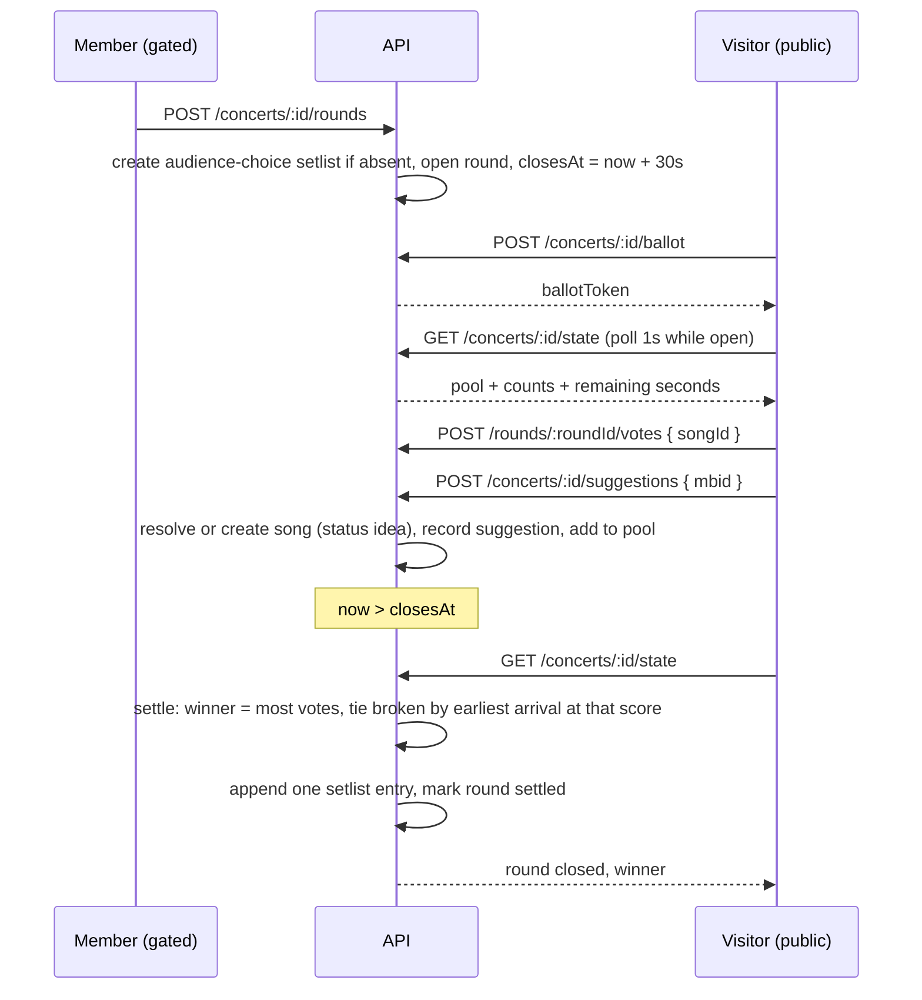

# The room picks the next song

## Perspectives confronted

- [x] **Client / business** — the operator chose audience participation as the single success metric, measured as ballots per round against the concert's `capacity` column, over "the band reopens a round" and "elected songs get played".
- [x] **Product** — the operator settled the pool, the ballot rule, the live feedback, the round mechanic, the tie rule, the empty round, and whether a suggestion is votable in the round it arrives in.
- [x] **Tech-lead** — the operator arbitrated the search source against three evaluated options ([ADR-0015](../../../../adr/0015-musicbrainz-stays-the-song-search-source.md)), the polling cadence, and the QR-code dependency ([ADR-0016](../../../../adr/0016-qrcode-react-for-the-audience-vote-qr-code.md)).
- [x] **Developer** — the operator was asked how a thirty-second round becomes assertable and chose to let the validator wait the full thirty seconds rather than add a duration parameter or a server-side clock switch. The cost is recorded in *Questions, Options and Decisions*.
- [x] **Designer** — the operator chose both entry points, QR code and short address, chose live counters with visible numbers, and required that audience suggestions read as not necessarily concert-ready.

## Why

A concert is the one moment the band and its audience are in the same room, and the audience has no way to say anything back. This feature gives the room a say in what is played next, on the band's terms: a member opens a thirty-second round from the stage, the room votes on a phone, and the winner joins a setlist the band actually plays from. It is the first thing in `pragma` a person outside the band ever touches.

**Output metric.** Audience participation: the share of the room that casts at least one ballot in a round. The concert already stores `capacity`, so the denominator exists without asking anyone for anything new. This is lagging and multi-causal — it depends on the venue, the crowd and how well the band announces the vote — and no automated gate proves it moved.

**Input metrics**, each machine-observable:
- A visitor who opens the vote page during an open round casts a ballot within thirty seconds.
- A visitor who suggests a song reaches a picked search result in under three attempts.
- A round that closes with at least one vote appends exactly one entry to the audience-choice setlist.

**Gemba.** The current behaviour is that nothing happens: `pragma` has no unauthenticated surface at all beyond health and sign-in, and every domain router opens with `requireSharedPasswordSession` (`apps/pragma/api/src/setlists/setlists.controller.ts:34`). The problem being solved is not a broken feature, it is an absent channel.

## Result

Two screens, one new and one extended.

**The vote page**, at `/vote/:sessionId` and at the short `/vote`, public and outside `RequireSession`. At rest it says no vote is running and offers a refresh control. During a round it shows a countdown, the pool as a tappable list with each song's live count, and a search field to suggest something the band does not have. Audience suggestions sit in the same list, visibly marked as not necessarily concert-ready, because they carry a catalogue status that is not `concert_ready`.

**The band's panel**, inside the setlist editor and the concert page, gated as everything else is. It carries the QR code for this concert, the button that opens a round, the live standing while the round runs, and the round history with each winner.

The API surface that did not exist before, all under `/api/audience`:

```
POST   /api/audience/concerts/:sessionId/ballot        public   mint a ballot token
GET    /api/audience/concerts/:sessionId/state         public   round, countdown, pool with counts, this ballot's votes
POST   /api/audience/rounds/:roundId/votes             public   { songId }
DELETE /api/audience/rounds/:roundId/votes/:songId     public   retract
GET    /api/audience/search?q=                         public   picked-result search on Deezer, see ADR-0015
POST   /api/audience/concerts/:sessionId/suggestions   public   { mbid }
POST   /api/audience/concerts/:sessionId/rounds        gated    open a round
GET    /api/audience/concerts/:sessionId/rounds        gated    history
```

## Use cases / edge cases



**Happy path.**
1. A member opens a round from the band's panel. The audience-choice setlist is created on this first round if the concert has none.
2. A visitor scans the QR code or types the short address and lands on the vote page.
3. The browser mints a ballot token on first contact and keeps it in local storage.
4. The visitor taps songs. Each tap is one vote; there is no limit on how many different songs one browser supports, and a second tap on the same song retracts it.
5. The page polls the state every second and shows the counts and the countdown moving.
6. Thirty seconds after opening, the first request to arrive settles the round: the song with the most votes wins, and one entry is appended to the audience-choice setlist.
7. The band's panel shows the winner and the setlist gains a line.

**The pool, stated once and precisely**, because two earlier readings of it contradicted each other. A song is in the pool when it is either a `concert_ready` catalogue song absent from every setlist of `kind` `manual` attached to this concert, or a song suggested from the room at this concert whatever its status. It leaves the pool when it wins a round. The audience-choice setlist is deliberately **not** read by this rule: it is attached to the concert like any other, so reading it would make the previous-winner exclusion fire twice for the same reason and hide which rule is doing the work.

**Edge cases.**
- Two songs tie on votes. Among songs sharing the top count, the winner is the one whose latest surviving vote is the earliest. Surviving matters: a retraction deletes its row, so the standing is always recomputed from the votes still there, and a song that briefly led and lost its supporters does not keep that lead.
- No vote at all. The round is blank, nothing is appended, and the member can open another.
- A song that won an earlier round is out of the pool for the rest of the concert, so the setlist never carries a duplicate.
- A suggestion arriving mid-round joins the pool of the round in progress and is votable immediately.
- A suggestion naming a song already in the catalogue resolves to that song rather than creating a second one, matched on `mbid`. A song suggested while already in a manual setlist for tonight is refused: the band is playing it anyway.
- A suggested song enters the pool with its own status, which is `idea` for a song the room invented and whatever it already was for a catalogue song. That status is exactly what the row renders as "not necessarily concert-ready", so the marker needs no separate flag.
- Nobody reads the state after `closesAt`. The round stays unsettled until the next read settles it; there is no scheduler, and settlement is idempotent.
- The short `/vote` address is opened when no concert is live. It resolves to the one concert that currently has an open round, and to nothing otherwise: it never guesses from the calendar. Two concerts cannot both have an open round, since a round is refused while one is running on that concert, and two concerts on the same night is not a case this iteration handles — the second band would use the full address.
- The visitor arrives with an expired or unknown ballot token. A fresh one is minted and the old votes are not recovered.

**Error cases.**
- A vote on a closed or already-settled round is refused with a conflict, not silently dropped.
- A vote on a song outside the current pool is refused.
- The upstream search is throttled or unreachable. The visitor sees a stated failure, not an empty result list. Reporting a throttle as emptiness is the defect [ADR-0015](../../../../adr/0015-musicbrainz-stays-the-song-search-source.md) exists to fix, and it applies to whichever provider answers.
- A picked result cannot be resolved to an `mbid`, because MusicBrainz is throttled or knows nothing of it. The song enters the catalogue anyway, with a null `mbid`, and the duplicate check falls back to normalised title and artist. A suggestion is never refused for a metadata lookup that failed.
- A round is opened on a session whose `kind` is `practice`. Refused: rounds belong to concerts.
- Two members open a round at the same instant. The second is refused while one is open on that concert.

## Questions, Options and Decisions

| Question | Options | Decision (2026-08-26) |
|---|---|---|
| What does the audience vote on? | Songs in tonight's setlist; the whole `concert_ready` catalogue; a band-curated shortlist | The union of the `concert_ready` catalogue songs absent from every **manual** setlist attached to this concert, and the songs suggested from the room at this concert whatever their status; minus the winners of earlier rounds. An encore pool, not a reordering of the band's plan. |
| How many votes per browser? | One song; one per song without limit; three maximum | One vote per song, unlimited songs, per round. |
| What does the audience see? | Live ranking with counts; ranking without numbers; blind | Live ranking with counts. The herd effect is accepted in exchange for the liveliness. |
| How do votes become setlist entries? | Entry on first vote, reordered live; the whole pool from the start; band promotes manually | Neither: a thirty-second round opened by the band, closing on one winner appended as one entry. This is what makes positions stable while a member reads the list. |
| Where do votes anchor? | On the setlist; on the setlist entry; on the concert | On the concert. A setlist is reusable across sessions (`session_setlist`), so votes keyed on a setlist would mix two concerts' rooms. |
| Tie at the close? | Earliest to reach the score; band arbitrates; both enter | Among the songs sharing the top count, the one whose latest surviving vote is earliest. Deterministic from the rows that remain, so retractions cannot make it ambiguous, and still sayable at the microphone as "it got there first". |
| No votes at the close? | Blank round; random pick | Blank round. |
| What is stored from a free-text suggestion? | A picked search result only; free text with band approval; free text shown as typed | A picked search result only. Nothing arbitrary is ever displayed, so no moderation has to be built. |
| Which search source? | MusicBrainz for both moments; Deezer for search with MusicBrainz resolving the pick; self-hosted mirror; none | **Deezer answers the search, MusicBrainz resolves the picked result.** Search runs on every keystroke for a whole room inside thirty seconds; resolution runs once per accepted suggestion. Nothing forces one provider to serve both, and separating them puts the hot path on the larger quota while keeping the `mbid`. Full rubric and the amendment's reasoning in [ADR-0015](../../../../adr/0015-musicbrainz-stays-the-song-search-source.md). The self-hosted mirror is impossible on the store this repo has: 39,961,031 recordings against DSQL's 3,000-row transaction ceiling. |
| Where does a winning suggestion live? | A nullable `song_id` on the entry; a catalogue song | A catalogue song with status `idea`. Forced, not chosen: `setlist_entry.song_id` is `NOT NULL` and DSQL accepts no `ALTER COLUMN DROP NOT NULL` (compat gaps §10). |
| Polling cadence? | 2 s always; 1 s always; 1 s in-round only | One second while a round is open, nothing at rest, plus a refresh control. There is no streaming transport: API Gateway HTTP API buffers the response. |
| When is the audience-choice setlist created? | At concert creation with a backfill; at concert creation only; at the first round | At the opening of the first round. No empty setlist is ever left on a concert that never ran a vote. |
| How is a thirty-second round asserted? | A bounded duration parameter; a preview-only server clock; the validator waits | The validator waits the real thirty seconds. **Accepted cost:** every closure assertion spends half a minute of suite time and becomes sensitive to a slow machine. Revisit if the visual-validation run gets flaky. |
| QR code generation? | `qrcode.react`; `qrcode`; write the encoder | `qrcode.react`. Rubric in [ADR-0016](../../../../adr/0016-qrcode-react-for-the-audience-vote-qr-code.md). |

**Out of scope.** Promoting an audience-suggested song beyond `idea` status. Any record that a song was actually played. Moderating or removing a suggestion. Voting during a practice. Any protection against a visitor who clears local storage to vote twice — see *Zero-defect strategy*.

## Architectural choices

The two decisions this feature could not take on its own, each ratified and committed before any code is written. `/technical-conception` reads this table for the ADR numbers the plan must reference.

| ADR | Decision | What it constrains downstream |
|---|---|---|
| [ADR-0015](../../../../adr/0015-musicbrainz-stays-the-song-search-source.md) | Deezer answers the search, MusicBrainz resolves the picked result; the shared cache and the typed failure apply to whichever provider answers | A new Deezer adapter and ranking serve `GET /api/audience/search`. Accepting a suggestion makes one MusicBrainz call to resolve the `mbid` and the metadata; the song is created either way, so the duplicate check degrades to title and artist when resolution fails. |
| [ADR-0016](../../../../adr/0016-qrcode-react-for-the-audience-vote-qr-code.md) | `qrcode.react` renders the QR code | One new dependency, reachable from exactly one atom, added to the workspace catalog. |

## Changes

### Types / domain model

Three new nouns, to be added to `apps/pragma/VOCABULARY.md` before any identifier is written. The person voting is deliberately not modelled: the vocabulary bans `user` and `account`, and only the ballot exists.

- **Voting round** — one thirty-second window, opened by a member on one concert, closing on at most one winner.
- **Ballot** — one browser's participation in one concert, identified by an opaque token the server mints. Not a person.
- **Audience suggestion** — the record that a song entered a concert's pool because someone in the room asked for it.

```ts
type VotingRound = {
  id: string; sessionId: string;
  openedAt: Date; closesAt: Date;
  settledAt: Date | null; winningSongId: string | null;
};
type AudienceVote = { roundId: string; ballotToken: string; songId: string; castAt: Date };
type AudienceSuggestion = { id: string; sessionId: string; songId: string; ballotToken: string; suggestedAt: Date };
type PoolEntry = { songId: string; title: string; artist: string; status: SongStatus; voteCount: number; isSuggestion: boolean };
```

### Database changes

Every constraint is declared on `CREATE TABLE`: DSQL accepts none afterwards. No `DEFAULT now()` on a business column, which `migrations.audit.test.ts` already gates. No foreign keys, per ADR-0006. Indexes are emitted plain and the migration runner rewrites them to `CREATE INDEX ASYNC`.

```sql
-- 0004_audience_voting.sql
CREATE TABLE "voting_round" (
  "id" uuid PRIMARY KEY DEFAULT gen_random_uuid() NOT NULL,
  "session_id" uuid NOT NULL,
  "opened_at" timestamp with time zone NOT NULL,
  "closes_at" timestamp with time zone NOT NULL,
  "settled_at" timestamp with time zone,
  "winning_song_id" uuid
);
CREATE TABLE "audience_vote" (
  "round_id" uuid NOT NULL,
  "ballot_token" text NOT NULL,
  "song_id" uuid NOT NULL,
  "cast_at" timestamp with time zone NOT NULL,
  CONSTRAINT "audience_vote_pk" PRIMARY KEY ("round_id", "ballot_token", "song_id")
);
CREATE TABLE "audience_suggestion" (
  "id" uuid PRIMARY KEY DEFAULT gen_random_uuid() NOT NULL,
  "session_id" uuid NOT NULL,
  "song_id" uuid NOT NULL,
  "ballot_token" text NOT NULL,
  "suggested_at" timestamp with time zone NOT NULL
);
CREATE TABLE "external_search_cache" (
  "normalized_query" text PRIMARY KEY NOT NULL,
  "hits" text NOT NULL,
  "expires_at" timestamp with time zone NOT NULL
);
CREATE INDEX "voting_round_session_opened_idx" ON "voting_round" ("session_id","opened_at");
CREATE INDEX "audience_vote_round_song_idx" ON "audience_vote" ("round_id","song_id");
ALTER TABLE "setlist_sheet" ADD COLUMN "kind" text;
```

`setlist_sheet.kind` stays nullable at the database level forever, because DSQL rejects `ADD COLUMN ... NOT NULL` and `ALTER COLUMN SET NOT NULL` alike. The write side always supplies a value and the read side narrows `string | null` to `'manual' | 'audience_choice'`, defaulting to `'manual'`. The drizzle column therefore carries neither `.notNull()` nor `.default()`, or every future `drizzle-kit generate` emits a statement DSQL refuses. An audience-choice setlist refuses `renameSetlist`, which is how "the title is not editable" is enforced on the server rather than by hiding a button.

One vote is one row. No counter column exists anywhere, because DSQL resolves conflicts at commit under optimistic concurrency and a counter row would be the one place every voter collides.

**Two boundaries worth stating.** `GET /api/audience/search` is a public façade only: the cache table, the adapter and the ranking all stay inside the `songs` context, which owns MusicBrainz, and the audience service calls the songs service rather than re-implementing the search. And the ballot token is stored in local storage **keyed by concert id**, so a visitor at a second concert is a second ballot; the token is opaque and server-minted, never derived from anything about the person.

### Files to change

```
apps/pragma/api/src/audience/audience.schema.ts                        // NEW
apps/pragma/api/src/audience/audience.controller.ts                    // NEW: public router + gated router, mounted separately
apps/pragma/api/src/audience/audience.service.ts                       // NEW
apps/pragma/api/src/audience/audience.repository.ts                    // NEW
apps/pragma/api/src/audience/round.core.ts                             // NEW: isRoundOpen, remainingSeconds, settleRound (now injected)
apps/pragma/api/src/audience/pool.core.ts                              // NEW: selectPool, tallyVotes
apps/pragma/api/src/audience/ballot-token.utils.ts                     // NEW: mint and validate the opaque token
apps/pragma/api/src/audience/open-ballot.middleware.ts                 // NEW: gate on a concert with an open round
apps/pragma/api/src/database/migrations/0004_audience_voting.sql       // NEW
apps/pragma/api/src/songs/musicbrainz.adapter.ts                       // UPDATE: cache to the shared table, non-ok returns a typed failure
apps/pragma/api/src/songs/search-cache.repository.ts                   // NEW
apps/pragma/api/src/setlists/setlists.schema.ts                        // UPDATE: kind column, resolveSetlistKind
apps/pragma/api/src/setlists/setlists.service.ts                       // UPDATE: renameSetlist refuses an audience-choice setlist
apps/pragma/api/src/app.ts                                             // UPDATE: mount both audience routers in the chain
apps/pragma/VOCABULARY.md                                              // UPDATE: voting round, ballot, audience suggestion
apps/pragma/site/src/App.tsx                                           // UPDATE: /vote and /vote/:sessionId outside RequireSession
apps/pragma/site/src/routes/vote/VotePage.tsx                          // NEW
apps/pragma/site/src/routes/vote/live-concert.core.ts                  // NEW: short-address resolution
apps/pragma/site/src/components/organisms/AudienceVoteList.tsx         // NEW
apps/pragma/site/src/components/organisms/SuggestSongField.tsx         // NEW
apps/pragma/site/src/components/organisms/VotingRoundPanel.tsx         // NEW: band side, in the setlist editor
apps/pragma/site/src/components/molecules/VoteCountdown.tsx            // NEW
apps/pragma/site/src/components/molecules/PoolSongRow.tsx              // NEW: carries the not-concert-ready marker
apps/pragma/site/src/components/atoms/VoteQrCode.tsx                   // NEW: wraps qrcode.react, the only file importing it
apps/pragma/site/src/lib/queries/audience.queries.ts                   // NEW: keys, 1 s refetch only while a round is open
apps/pragma/site/src/lib/ballot-token.adapter.ts                       // NEW: local-storage read and write
apps/pragma/site/src/i18n/{en,fr}.json                                 // UPDATE: parity test gates both
apps/pragma/package.json, pnpm-workspace.yaml                          // UPDATE: qrcode.react catalog entry
```

### Test strategy

- **Unit tests at 100% coverage** on `round.core.ts`, `pool.core.ts`, `ballot-token.utils.ts` and `live-concert.core.ts`, as `*.core.ts` and `*.utils.ts` both carry the gate. `round.core.ts` takes `now` as a parameter and never calls `new Date()`, so `vi.setSystemTime` is the only clock. The cases that must be pinned: the tie broken on the earliest latest-surviving vote, the same tie after a retraction reshuffles it, the blank round, a settlement that runs twice and changes nothing, and a vote arriving one millisecond after `closesAt`. `pool.core.ts` must pin that a manual setlist excludes a song and the audience-choice setlist does not.
- **Controller tests** for every error case above, each asserting the status code and not merely the absence of a crash. The public routes are tested without a session cookie, which no existing controller test does.
- **Visual validation** drives, at 375 px and 1280 px: opening a round from the band's panel; the public page at rest showing no vote and a refresh control; casting and retracting a vote with the count moving; suggesting a song through a picked search result and seeing it appear marked as not concert-ready; the countdown reaching zero and the winner appearing in the setlist. The validator waits the real thirty seconds for the closure assertions, which is the accepted cost recorded above. It drives the public page in a context with no session cookie, so the run must not reuse the band's browser profile.
- **Technical validation** on the diff, with a specific pass on the two rules this feature is most likely to break: no refetch on a mutation carrying `onMutate`, and no `useEffect` where the countdown can be derived during render from `closesAt` and a clock store the site already has.
- **Coverage gates already in place** are untouched: nothing here changes `infra/cdk/**` or `infra/shared/**`.
- Output metrics are out of scope for visual validation. A green run proves the flows work, never that the room participated.

## Production strategy

### Analytics

**Input metrics**, from named events on the API:
- `audience_ballot_minted`, `audience_vote_cast`, `audience_vote_retracted`, `audience_suggestion_accepted`, `audience_round_opened`, `audience_round_settled` with the winner and the vote total, `audience_round_blank`.
- Ballots per round against the concert's `capacity`, reported per concert on the band's panel. Target for a first real concert: any non-zero value, since the baseline is that no channel exists.
- Time from page open to first vote, p75 under thirty seconds, which is the whole round.
- Search failure rate, meaning throttled or non-ok upstream responses over total searches. Above five percent in a concert, the cache is not doing its job and the cold search path is the bottleneck.
- Resolution failure rate, meaning accepted suggestions that entered the catalogue with a null `mbid`. This is the price ADR-0015 accepts for taking search off MusicBrainz, and it is the number that says whether the price is real.

**Output metric.** Audience participation is reviewed by the band after each concert, by hand, against what the room felt like. There is no instrument that can tell the difference between a room that did not care and a room that did not hear the announcement, so this stays a conversation and not a dashboard.

### Zero-defect strategy

- `RoundAlreadyOpenError` — a second round opened on a concert that has one running. Fires on the gated route. Expected to be rare; more than twice in one concert means the band's panel is not showing the round state clearly.
- `RoundClosedError` — a vote or a suggestion arriving after `closesAt`. Expected and normal at the boundary of every round; alert only if it exceeds a third of the votes in a round, which would mean the countdown shown to the room is wrong.
- `SongNotInPoolError` — a vote for a song the pool does not carry. Any occurrence is a client and server disagreement about the pool and is worth reading.
- `ExternalSearchUnavailableError` — the new typed failure replacing the silent empty list. Alert on five occurrences in five minutes, which is the shape of a throttled concert.
- **Ballot fraud is not defended against, and this is a deliberate limit.** A visitor who clears local storage gets a fresh token and votes again. The mitigations are the existing IP-hash rate limiter reused from `apps/pragma/api/src/auth/`, and the fact that the ballot only counts inside a thirty-second window the band controls. Anyone describing this as tamper-proof is wrong; it is a bar, not an election.
