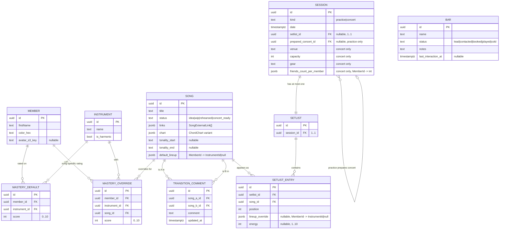

# Pragma — first features: catalog, setlist, sessions, CRM bars

Bootstrap spec for `apps/pragma/`, the band's private ERP/CRM/PWA at `pragma.borso.fr`. Five band members, shared password, mobile + desktop equal-class PWA, offline read for catalog + chord charts + planned setlists.

## Perspectives confronted

> *Hard gate: every checkbox must be ticked **and** carry a one-line justification before any other section is drafted.*

- [x] **Client / business** — confirmed by the band's only stakeholder (Hugo, also the developer): the band's current workflow (chord charts on phones, setlists in WhatsApp, mastery info in heads) costs rehearsal time and produces avoidable concert errors; an in-app single source of truth is wanted.
- [x] **Product** — value prioritisation done across 8 rounds: catalog + setlists + transition warnings are MVP; energy curve viz is MVP single-setlist only; CRM bars is MVP minus push notifications.
- [x] **Tech-lead** — stack pinned to the `last-loop-lepin` full-stack pattern (Vite + Hono + DSQL + CDK); shared password rejected for individual auth on cost/benefit; OCR moved to Q.O.D.; concurrency is last-write-wins.
- [x] **Developer** — testability call: every domain rule (transition warning, tonality derivation from ChordPro, lineup defaulting, energy-curve smoothing) lives in `*.core.ts` with `now` injection, gated at 100%. User-stated rule: *"je veux TOUJOURS le maximum de tests"* — codified in KAIZEN as a CLAUDE.md amendment.
- [x] **Designer** — Claude Design pass shipped on 2026-05-19. Decisions adopted into production (no Tweaks panel — that was a design-time exploration tool, not a runtime feature): editorial-jazz aesthetic (Instrument Serif display + Geist body + JetBrains Mono for tags), cream paper background, **blue accent** (user override on the design's original amber), member palette of 5 distinct equal-chroma hues (coral / teal / mustard / plum / sage), **member style: `chip`**, **energy viz: `sparkline`**, **mobile drag pattern: `handle`**, **density: `comfortable`**, dark mode opt-in via OS `prefers-color-scheme` only (no in-app toggle in v1), responsive layout (desktop ≥ 1024 px, mobile < 1024 px — no manual frame switcher). Side-gutter transition warnings, inline chord chart preview that taps into a fullscreen Mode Scène, kanban + list views for bars.

> Designer pass complete (2026-05-19). Source files (HTML/JSX/CSS prototype) live under `docs/features/pragma/first-features/spec/design-bundle/` for future reference; implementation re-creates them in production code under `apps/pragma/site/`.

## Why

This is the band's tool. The single measurable outcome is **rehearsal-time efficiency** — less time spent figuring out who plays what / which chart is current / which transition is broken, more time playing.

- **Output metric (lagging, monthly self-report by the band):** rehearsal sessions feel "ready" without a 15-min warmup of clarifications. Measured by post-rehearsal one-tap survey ("did we lose time on logistics? y/n"). Target: <20% of rehearsals tagged as logistics-lossy at month 3.
- **Input metrics (leading, instrumented):**
  - `setlist_opened_offline` — count of setlist views with `navigator.onLine === false`. Target: >50% of pre-concert setlist views happen offline. Confirms the PWA value prop is real.
  - `transition_warning_resolved` — pairs of consecutive songs where the warning fired and a `TransitionComment` was added. Target: 100% of fired warnings carry a comment within 7 days.
  - `chord_chart_attached_per_song` — % of songs with a chart in any of the 3 supported formats. Target: 100% of `concert_ready` songs.
- **Gemba:** Hugo (the user) is in the band. The friction is observed first-hand at every rehearsal and concert. No external research needed; the field is the developer's own.

## Result

Visible result: a French-language PWA at `pragma.borso.fr` (private, shared password) implementing the Claude Design bundle pixel-by-pixel — editorial-jazz aesthetic, blue accent on cream paper, responsive layout, fullscreen Mode Scène for chord display, side-gutter transition warnings, drag-reorder setlist, kanban + list bars view. The 12-file prototype under `docs/features/pragma/first-features/spec/design-bundle/` is the visual source of truth; this spec is the functional one.

Functional surfaces required (one route group per capability):

- `/catalog` — songs list + per-song detail (title, status, links, charts, tonality, default lineup, mastery matrix).
- `/sessions` — practices + concerts. Concert detail = gear, date, venue, capacity, friends-per-member, setlist, energy curve.
- `/sessions/<id>/setlist` — drag-reorder song list, lineup-override per entry, energy 1-10 slider, transition warning surface, transition comment.
- `/bars` — CRM list + kanban view.
- `/members` — admin (firstName, color, avatar).
- `/instruments` — admin (name, `isHarmonic` flag).

**No public-facing view.** All routes are behind the shared password.

## Use cases / edge cases

Visual: per-capability sequence sketch. Full BPMN deferred to designer pass.

### 1. Catalog — add a song
1. User opens `/catalog`, taps "new song".
2. Enters title; selects status (`idea` default).
3. Pastes Spotify/Deezer/YouTube URL → embed renders inline (oEmbed/iframe).
4. Pastes ChordPro text, or uploads PDF, or uploads image of a chart.
5. **If ChordPro text:** the `tonality.core.ts` deduces start / end tonality from first / last chord. User can override.
6. **If PDF/image:** tonality fields are manual.
7. Selects default lineup: for each Member, picks an Instrument. Optional; can be left empty.
8. (Optional, per-song override) Edits the mastery override on the song detail: for any (Member, Instrument) cell where this song deviates from the band-wide default, sets a 1-10 score that overrides the default for this song only. Most songs leave this empty and inherit the global matrix.
9. Saves. Song lands in the catalog.

### 1bis. Members admin — edit the global mastery matrix
1. User opens `/members`.
2. Sees the 5-member × 7-instrument matrix, each cell holding a 0-10 score. Click a cell to edit; scroll-wheel to ±1; right-click to clear.
3. Row averages (per-member overall musicianship) and column averages (per-instrument bench strength) update live.
4. This matrix is the **global default**; per-song overrides (see step 1.8) shadow these values only where set.

Edge cases:
- Two members open the same song concurrently → last-write-wins; the loser's edit is silently discarded.
- ChordPro pasted with no recognizable chord on first/last line → tonality fields stay empty, no error.
- Spotify URL on a region-locked track → embed renders Spotify's own error UI; no app-level handling.
- Image upload >10 MB → reject client-side with toast.

### 2. Setlist — build for a concert
1. User opens the concert, taps "build setlist".
2. Drags songs from the catalog into ordered positions.
3. For each `SetlistEntry`, optionally overrides the default lineup per member.
4. As soon as 2+ entries exist, the **transition warning** is computed for each consecutive pair. A pair warns if **no harmonic instrument is held by the same member across the two songs**. Warning is a visual marker on the boundary, with hover/tap revealing the offending instrument list.
5. User attaches a `TransitionComment` to the (songA, songB) pair (global, not per-session — comment is shared across all setlists using that ordering).
6. User fills in energy 1-10 per entry; the curve renders below.
7. Saves implicitly on each edit (no draft mode).

Edge cases:
- Same song appears twice in the setlist (legitimate: encore) → allowed; transition warning still computed between each adjacent pair.
- A member is absent for a song (lineup override leaves them out) → warning algorithm treats them as not holding any instrument on that song.
- Energy slider left null → curve renders a gap; no error.
- Setlist edited concurrently by two members → last-write-wins on the whole `SetlistEntry[]`.

### 3. Sessions — link practices to concerts
1. User creates a `Concert` with date / venue / capacity / gear.
2. Each band member opens the concert, fills in their `friendsCountPerMember` field.
3. User creates a `Practice` and links it to the upcoming concert via `preparedConcertId`.
4. Practice and concert can share or have distinct setlists.

Edge case:
- Practice's setlist diverges from its prepared concert's setlist → both stored independently; no auto-sync.

### 4. CRM bars — track venues
1. User adds a `Bar` (name, status, notes, last interaction date).
2. Switches between list view and kanban.
3. At login, the app surfaces an in-app banner for bars with no interaction for >N days (N to define with designer; default 60).

Edge case:
- Bar deleted while displayed in the kanban → optimistic remove; refetch confirms.

### 5. Offline use
1. On install (and on every successful sync after that), the PWA service worker caches: the full catalog + all chord charts (3 formats) + **the setlist of the next upcoming session only** (whichever session — practice or concert — has the smallest future `date`).
2. User boards the metro to the concert, no signal.
3. Opens the catalog or the next session's setlist, reads chord charts, sees the energy curve. All works.
4. Edits made offline? **Not supported in v1.** All writes require online; the UI surfaces an "offline — read-only" banner.
5. Subsequent (further-in-the-future) sessions' setlists are not cached. Opening them offline shows an empty state.

## Domain model — relational diagram



Notes on the diagram:
- Mastery splits in two: `MASTERY_DEFAULT` holds the band-wide global score for `(member, instrument)` — unique index on the pair, max 35 rows. `MASTERY_OVERRIDE` holds the sparse per-song deviations — unique index on `(member_id, instrument_id, song_id)`, only rows where a song genuinely deviates from the default exist. Effective mastery = `override ?? default`.
- `TRANSITION_COMMENT` is the **ordered** pair (A→B). Unique index on `(song_a_id, song_b_id)` — so A→B and B→A can coexist as two distinct rows.
- `SESSION` is single-table inheritance keyed by `kind`. Concert-only columns are nullable; the API validates the shape per kind.
- `SETLIST` is split from `SESSION` (rather than embedded) so a session can swap its setlist without copying the entries array.
- JSONB blobs (`links`, `chart`, `default_lineup`, `lineup_override`, `friends_count_per_member`) are validated via Zod on read/write; their shapes are pinned in the *Types* section.

## Questions, Options and Decisions

| Question | Options | Decision (date) |
| --- | --- | --- |
| App-workspace slug | `pragma-musik`, `pragma-erp`, `pragma` | `pragma` (2026-05-19) — Hugo reserved the bare slug; the `test-app` rename in CLAUDE.md's *Don'ts* targets the old borso-platform fixture, not this. KAIZEN item to amend the rule. |
| Auth model | individual accounts vs shared password | shared password (2026-05-19) — 5 known people, audit not needed, friction tax of per-user login wasted on this scale. Migration path documented in Q.O.D. |
| Concurrency | OT / CRDT / advisory lock / last-write-wins | last-write-wins (2026-05-19) — 5 users, rare overlap, complexity of anything else not justified. |
| Mastery matrix locus | per-song only / per-member-global only / hybrid | **hybrid** (2026-05-19, revised after designer pass) — global default lives at `MasteryDefault(Member, Instrument) → 0..10` (35 cells, edited from `/members`); per-song override lives at `MasteryOverride(Member, Instrument, Song) → 0..10` (sparse, edited from `/songs/<id>`). A song's effective mastery for `(member, instrument)` is `override ?? default`. Mean mastery for a song = average of `effective(member, lineup[member])` across the lineup. |
| Transition warning rule | which combinations trigger | a pair warns iff **no harmonic instrument stays held by the same member across both songs** (2026-05-19). The list of tonal instruments is data, set per-instrument via `isHarmonic: boolean`. |
| Transition comment locus | per-session or global per song-pair | global per (songA, songB) (2026-05-19) — the issue is musical, not per-event. One comment, reused everywhere that pair appears. |
| Transition comment orientation | ordered pair or unordered pair | **ordered** (2026-05-19) — A→B is a different musical transition than B→A and warrants its own comment. The DB unique index is on the ordered pair `(song_a_id, song_b_id)`. If a song appears several times in a setlist and creates multiple A→B occurrences, they all share the single ordered-pair comment. |
| Mastery matrix UI locus | song detail / dedicated matrix view / both | **both** (2026-05-19, revised) — the global default matrix lives on `/members` as a 5×7 editable grid (row + column averages, click/scroll/right-click affordances); per-song overrides are edited inline on the song detail. Aligned with the hybrid model above. |
| Accent color | amber / blue / other | **blue** (2026-05-19) — user override on the design's stage-light amber. Cobalt-ish to pair with the cream paper. Tokenised as `--accent` so future palettes are one CSS-variable swap. |
| Offline cache scope for setlists | all future / next session only / all setlists | **next session only** (2026-05-19) — bounded by what fits in the PWA cache budget and matches the actual offline need (the concert you are heading to). |
| Energy viz | single setlist / comparator | single-setlist only in v1 (2026-05-19) — comparator deferred. |
| Chord chart formats | one canonical / accept all | accept ChordPro text + PDF + image, no privileged format (2026-05-19) — friction of conversion higher than the cost of storing 3 shapes. |
| OCR/import of charts | automatic / assistant / none | assistant (2026-05-19, Q.O.D.) — user pastes a PDF or photo, system proposes a ChordPro draft, user corrects before save. Quality is honest about scan vs photo. |
| Embeds for external links | oEmbed iframes / link only | iframes (Spotify, Deezer, YouTube all support iframe embeds) (2026-05-19). |
| Concurrent-edit story for setlist | warn / merge / overwrite | overwrite (last-write-wins) (2026-05-19) — same answer as global concurrency. |
| DB seed | import / manual UI entry | manual UI (2026-05-19) — no historical data to import. |
| `friendsCountPerMember` | who fills it | each member fills their own count (2026-05-19) — for venue capacity planning. |
| Code language | English / French / mixed | **English** (2026-05-19) — repo convention: all code, schemas, identifiers, comments, and specs are in English. |
| User-facing language | FR only / EN only / FR+EN i18n | **FR + EN i18n** (2026-05-19) — the platform serves the band (FR) but is built as a portfolio piece visible to EN-speaking reviewers. Implies a translation layer (e.g. `react-i18next`) on every user-visible string and locale-aware date/number formatting via `Intl`. User-input data (song titles, notes, comments) stays in whatever language the user typed; no auto-translation. |

**Out of scope (explicit, do not implement):**
- Ultimate Guitar automated rip (CGU §2.6 prohibits scraping — flagged in KAIZEN for `docs/knowledge/`).
- Setlist versioning / history.
- Per-user audit trail (shared password).
- Push or email notifications.
- Public-facing views.
- Energy-curve comparator across setlists.
- Offline writes (read-only offline in v1).
- Migration to individual auth (Q.O.D. for v2, when band grows).

## Changes

### Types / domain model

```ts
// Domain entities — all per-band, no multi-tenant concerns.

type MemberId = string;
type SongId = string;
type InstrumentId = string;
type SessionId = string;
type BarId = string;

interface Member {
  id: MemberId;
  firstName: string;
  color: string;        // hex, used to tint Member chips across UI
  avatarS3Key: string | null;
}

interface Instrument {
  id: InstrumentId;
  name: string;
  isHarmonic: boolean; // governs the transition-warning algorithm
}

type SongStatus = 'idea' | 'wip' | 'rehearsed' | 'concert_ready';

interface SongExternalLink {
  url: string;
  provider: 'spotify' | 'deezer' | 'youtube' | 'other';
  comment: string;
}

type ChordChart =
  | { kind: 'chordpro'; text: string }
  | { kind: 'pdf'; s3Key: string }
  | { kind: 'image'; s3Key: string };

interface Song {
  id: SongId;
  title: string;
  status: SongStatus;
  links: SongExternalLink[];
  chart: ChordChart | null;
  tonalityStart: string | null; // free-form; deduced or manual
  tonalityEnd: string | null;
  defaultLineup: Record<MemberId, InstrumentId | null>;
}

interface MasteryDefault {
  member: MemberId;
  instrument: InstrumentId;
  score: number; // 0..10 ; 0 = "ne joue pas"
}

interface MasteryOverride {
  member: MemberId;
  instrument: InstrumentId;
  song: SongId;
  score: number; // 0..10 ; only exists when the song deviates from the global default
}

type SessionKind = 'practice' | 'concert';

interface SessionBase {
  id: SessionId;
  kind: SessionKind;
  date: string;     // ISO
  setlistId: SetlistId | null;
}

interface Practice extends SessionBase {
  kind: 'practice';
  preparedConcertId: SessionId | null;
}

interface Concert extends SessionBase {
  kind: 'concert';
  venue: string;
  capacity: number;
  gear: string;
  friendsCountPerMember: Record<MemberId, number>;
}

type SetlistId = string;

interface SetlistEntry {
  song: SongId;
  position: number; // 0-indexed
  lineupOverride: Record<MemberId, InstrumentId | null> | null;
  energy: number | null; // 1..10
}

interface Setlist {
  id: SetlistId;
  sessionId: SessionId;
  entries: SetlistEntry[];
}

interface TransitionComment {
  songA: SongId;
  songB: SongId;
  comment: string;
  updatedAt: string;
}

type BarStatus = 'lead' | 'contacted' | 'booked' | 'played' | 'cold';

interface Bar {
  id: BarId;
  name: string;
  status: BarStatus;
  notes: string;
  lastInteractionAt: string | null;
}
```

### Database changes

DSQL Postgres, fresh schema (no migration from a previous state). One schema `pragma`, tables: `member`, `instrument`, `song`, `song_external_link`, `mastery_default`, `mastery_override`, `session`, `setlist`, `setlist_entry`, `transition_comment`, `bar`. UUID PKs everywhere. JSONB for `Song.links`, `Song.chart`, `SetlistEntry.lineup_override`, `Concert.friends_count_per_member`. Avatars / charts in S3 under `pragma-uploads-<env>/`.

Indexes day 1:
- `setlist_entry (setlist_id, position)` for ordered reads.
- `mastery_default (member_id, instrument_id) unique` — at most one default per (member, instrument) pair.
- `mastery_override (member_id, instrument_id, song_id) unique` — at most one override per (member, instrument, song) triple; the sparse-by-design table only holds rows that deviate from the default.
- `transition_comment (song_a_id, song_b_id) unique` to enforce one comment per ordered pair.

### Files to change

```
apps/pragma/                                                 // NEW workspace
apps/pragma/package.json                                     // NEW
apps/pragma/site/                                            // NEW: Vite + React PWA
apps/pragma/site/src/routes/catalog/                         // NEW: list + detail
apps/pragma/site/src/routes/sessions/                        // NEW: list + concert detail + practice detail
apps/pragma/site/src/routes/sessions/setlist/                // NEW: setlist editor
apps/pragma/site/src/routes/bars/                            // NEW: list + kanban
apps/pragma/site/src/routes/members/                         // NEW: admin
apps/pragma/site/src/routes/instruments/                     // NEW: admin
apps/pragma/site/src/sw/                                     // NEW: PWA service worker, offline cache
apps/pragma/site/src/i18n/                                   // NEW: react-i18next setup + en.json / fr.json catalogs
apps/pragma/site/src/i18n/i18n.utils.ts                      // NEW: locale detection + Intl date/number helpers, 100% gated
apps/pragma/api/                                             // NEW: Hono on Lambda
apps/pragma/api/src/domain/transition.core.ts                // NEW: warning rule, 100% gated
apps/pragma/api/src/domain/tonality.core.ts                  // NEW: derive start/end from ChordPro, 100% gated
apps/pragma/api/src/domain/lineup.core.ts                    // NEW: default + override resolution, 100% gated
apps/pragma/api/src/domain/energy-curve.core.ts              // NEW: 1..10 smoothing for viz, 100% gated
apps/pragma/api/src/domain/mastery.core.ts                   // NEW: effective = override ?? default; song-mean over lineup; 100% gated
apps/pragma/site/src/design-tokens.css                       // NEW: blue accent, member palette, paper background, type scale (Instrument Serif / Geist / JetBrains Mono)
apps/pragma/api/src/routes/                                  // NEW: REST endpoints, integration-tested
apps/pragma/cdk/                                             // NEW: stack composing LambdaApi + StaticSite + DsqlCluster + DsqlSchema + S3 uploads bucket
infra/shared/                                                // UPDATE: register pragma.borso.fr cert if not covered by wildcard
.github/path-filters.yml                                     // UPDATE: add pragma filter
commitlint.config.js                                         // UPDATE: add 'pragma' to scope-enum
CLAUDE.md                                                    // UPDATE: amend "Don'ts" to authorize apps/pragma/ + carve in "always max tests" rule (KAIZEN follow-up)
docs/features/pragma/first-features/spec/design-bundle/      // NEW: archived Claude Design HTML/JSX/CSS prototype, source of UI truth
```

### Test strategy

> *Autonomous pipeline — no human-in-the-loop sweep. User-stated rule for this repo: always maximum tests.*

- **Unit tests on `*.core.ts` at 100% coverage** (statement/branch/function/line). Every domain rule listed above:
  - `transition.core.ts` — exhaustive table-driven test: every combination of (songA lineup, songB lineup, instrument tonal flags) maps to expected warning state. Edge case: same song twice. Edge case: missing member.
  - `tonality.core.ts` — ChordPro parser fixtures covering valid first/last chord, ambiguous chord, no chord, malformed input.
  - `lineup.core.ts` — default + override merge semantics. Override null vs absent vs explicit-null-instrument disambiguation.
  - `energy-curve.core.ts` — nullable points, all-null, all-equal, monotonic, peak detection.
  - `mastery.core.ts` — `effective(member, instrument, song)` = override ?? default, `meanForSong(songId, lineup)` = average over lineup, plus "who can play this song" / "what songs can this member sing" aggregations with rank thresholds. Edge case: missing default. Edge case: override = 0.
- **Unit tests on `*.utils.ts` at 100% coverage**: formatters (date, capacity), color contrast for Member chips, embed-URL detector (Spotify vs Deezer vs YouTube vs other), kebab-case utilities.
- **Integration tests on the back-end** using the repo's Docker-less Postgres via `scripts/local-postgres.sh`: full CRUD for songs, setlists, sessions, bars; concurrent-edit last-write-wins semantics; auth middleware (shared password).
- **Front-end component tests** for the setlist drag-reorder behavior, kanban column moves, energy slider, ChordPro text editor.
- **i18n coverage test** (back-end script): asserts that every key referenced by the front-end exists in both `en.json` and `fr.json`, and that the two catalogs have the exact same key set (no missing translations on either side).
- **Visual validation rows** — each numbered happy-path step under *Use cases* becomes one `/visual-validation` assertion driven against the running dev server. The design bundle under `docs/features/pragma/first-features/spec/design-bundle/` is the pixel-level reference for these assertions:
  - Catalog: a new song with all 3 chart formats can be created and re-read.
  - Setlist: dragging produces a new order; warning surfaces between known-bad pairs from fixtures.
  - Setlist: energy curve renders with N+1 points for N entries (or null gaps).
  - Sessions: a Practice with `preparedConcertId` shows the concert link; concert detail shows friends counts per member.
  - Bars: kanban column move persists; list view shows the stale-bar banner at login.
  - PWA: offline mode reads catalog + charts + planned setlist; writes fail with a clear UI.
- **Technical validation** runs the full suite + lint + knip + typecheck + build, and a per-Q.O.D. diff pass.
- **Coverage gates already in place** stay in place. `infra/cdk/**` and `infra/shared/**` are 100% line-coverage gated; the new pragma CDK stack must restate the impact in its PR.
- **Manual sweeps are not the test strategy.** The only manual step is a post-deploy smoke (load `/catalog`, see one fixture song) after the first prod deploy.

## Production strategy

### Analytics

Out-of-the-box events on every page view + every domain mutation. CloudWatch metrics, no third-party analytics.

**Input metrics (driven by events, gated):**
- `setlist_opened_offline` — incremented when `navigator.onLine === false` at view time.
- `transition_warning_fired` — count of pair-warnings shown.
- `transition_comment_attached` — count of comments saved on warned pairs.
- `chord_chart_attached` — count of new charts attached (any format).
- `pwa_install_completed` — count of `beforeinstallprompt` accepts.
- Latency p50/p75/p90 on each API endpoint. Alert threshold: p90 > 800 ms over 15 min.

**Output metrics (lagging, measured monthly):**
- Band one-tap survey after each rehearsal: "logistics-lossy y/n". Aggregated in a simple dashboard, reviewed monthly.
- Hugo qualitative review: 1-5 score on "did the app save time this month?".

### Zero-defect strategy

- Named error classes: `ChordChartTooLarge`, `OfflineWriteAttempted`, `SetlistConcurrencyLost`, `TransitionAlgorithmInputInvalid`, `EmbedProviderUnknown`. Each carries a Sentry tag.
- Alert thresholds:
  - Any unhandled exception in the catalog mutation path → page Hugo on first occurrence.
  - `TransitionAlgorithmInputInvalid` ≥ 1 occurrence in 24 h → page Hugo immediately (it implies a corrupted domain object reached the algorithm).
  - 5xx rate > 1% over 15 min → page.
  - DSQL connection errors > 3 in 5 min → page.
- The shared-password auth has no per-user audit; failed login attempts are still logged with `ip_hash` and rate-limited (5 attempts / 15 min per IP) to deter brute force.

## Designer-pass resolutions

The questions listed here as "open" pre-designer have all been resolved by the Claude Design bundle (2026-05-19). They are kept for traceability:

1. **Mobile-vs-desktop layout for the setlist editor** — handle drag pattern on mobile (preserves discoverability over long-press; gesture-free), energy slider inline on each row, transition warnings in a left-side gutter with margin markers (severity-coloured `!`).
2. **Visual treatment of Member colors** — **chip** (small coloured initial in a circle); 4 alternative treatments (`pill`, `accent`, `avatar`) explored during design but not surfaced at runtime.
3. **Kanban visual for bars** — 5 status columns (`lead`, `contacted`, `booked`, `played`, `cold`); medium-density cards showing name + last-interaction date + small notes preview + contact-owner initial.
4. **Energy curve chart style** — **sparkline** (compact, fits the row-density of the setlist; alternates `bars` / `stripe` / `gradient` explored but not surfaced at runtime).
5. **Chord chart viewer** — inline preview on the song detail page; tap to enter fullscreen **Mode Scène** (black background, large chord grid, auto-scroll, A−/A+ zoom, keyboard nav, song-pill carousel of the setlist).
6. **PWA install prompt** — floating card 16 px from sides + 80 px above the bottom of the mobile nav; **offline-mode banner** is a full-width strip across the top of the main content area with a pulse indicator and a retry shortcut.
