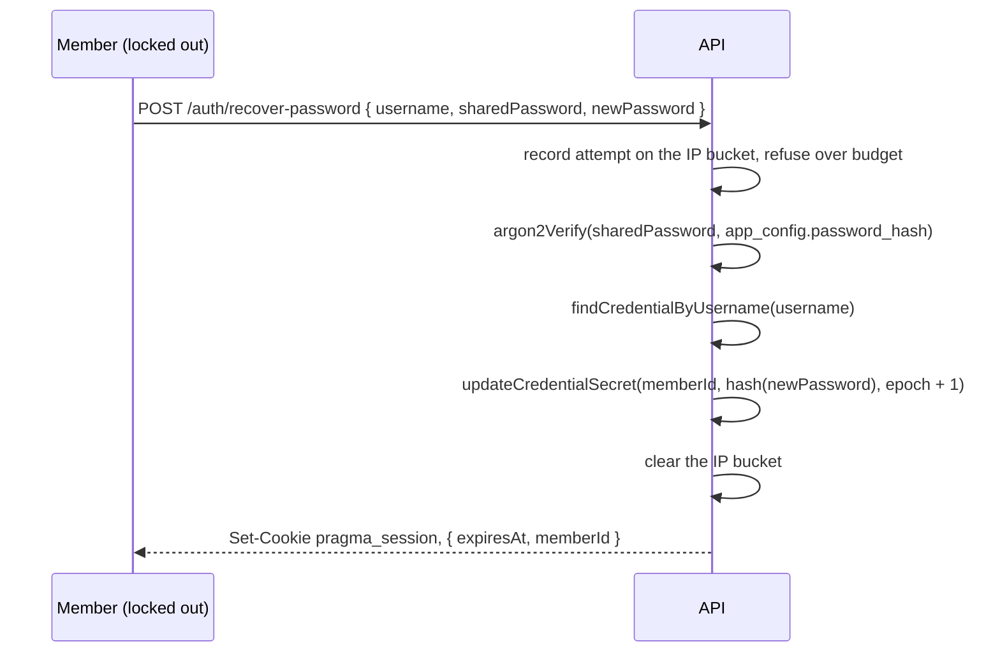

# A member who forgot their password gets back in with the band password

## Perspectives confronted

- [x] **Client / business** — the operator chose member autonomy as the objective: someone who is locked out gets back in without writing to anyone. They were told it is not measurable across five people without dedicated analytics, and kept it anyway; the *Why* names machine-observable input metrics instead.
- [x] **Product** — the operator chose identification by typed username over a public list of enrolled members, chose to sign the member in on success rather than bounce them to the login form, and chose to keep the member's passkeys alive through a recovery.
- [x] **Tech-lead** — the operator was shown that `POST /api/auth/enrol` verifies the band password with no rate limit at all, and chose to throttle every door onto that secret rather than harden only the new one. That decision was then superseded by the one below, which removes the other door entirely.
- [x] **Developer** — the operator was shown that `buildAuthenticatedApp` reaches the enrol endpoint on behalf of eighteen controller test files, and accepted rewriting the helper's internals while keeping its signature, so those eighteen files stay untouched.
- [x] **Designer** — the operator chose a dedicated `/recover` screen reached from a link under the sign-in form, mirroring the shape of `/enrol`, over an in-place expansion of the sign-in card.

## Why

`pragma` has no way back in. A member who forgets their password cannot change it, because `PUT /api/me/password` demands the current one, and cannot re-enrol, because `selectEnrolmentWindow` only offers members who hold no credential yet. The only remaining path is an operator opening `scripts/dsql-shell.sh` against the production cluster with the `borso-admin` profile and writing an argon2 hash by hand — which is exactly what happened on 2026-09-17, and what this feature exists to make unnecessary. The band password already proves membership; it should be enough to reclaim an account.

**Output metric.** Member autonomy: a locked-out member regains access without asking anyone. It is lagging and, across five people, not measurable without analytics nobody wants to build — so no automated gate proves it moved, and this spec does not pretend otherwise.

**Input metrics**, each machine-observable:
- A member who knows the band password and their username reaches a signed-in `/catalog` from `/recover` in one submission.
- Three wrong band passwords from one address close the door for an hour.
- No production database session is needed to reset a password.

**Gemba.** Observed on 2026-09-17. The recovery took a `psql` session against the prod schema, a hand-built argon2 hash with five parameters that had to match `hashPassword` exactly, and a manual `session_epoch` increment that nothing would have caught if forgotten. Three steps, each silently skippable, for a band of five.

## Result

**A new screen at `/recover`**, public, outside `RequireSession`, reached from a *Forgot your password?* link under the sign-in form. Same `Card`, same width, same *Back to sign in* return as `/enrol` has today. Three fields: the member's username, the band password, the new password. On success the member is signed in and lands on `/catalog`.

**One new endpoint**, replacing two that go away:

```
POST /api/auth/recover-password   public   { username, sharedPassword, newPassword }  →  200 { expiresAt, memberId }
```

**Two endpoints deleted**, with the screen they served:

```
GET  /api/auth/enrolment   gone
POST /api/auth/enrol       gone
```

## Use cases / edge cases



**Happy path.**
1. The member opens `/login`, sees they cannot get in, and follows *Forgot your password?*.
2. They type their username, the band password, and a new password of at least eight characters.
3. The server verifies the band password, finds the credential, replaces the hash and increments `session_epoch`.
4. The response carries a session cookie; the member lands on `/catalog` already signed in.
5. Every other session that member had open elsewhere is now refused, because its cookie carries the previous epoch.

**The shared secret is verified before the username is looked up**, always, so a wrong band password costs the same argon2 work whether or not the username exists, and both failures answer with one message.

**Edge cases.**
- The member's passkeys survive. `member_passkey` is untouched and keys off `member_id`, so the member's existing devices still sign in, and the epoch they read is the new one.
- The username is typed with capitals or spaces. `usernameSchema` trims and lowercases before the lookup, as the login form already does.
- The new password equals the old one. Allowed; the hash is rewritten with a fresh salt and the epoch still moves, which is what invalidates the other sessions.
- The application was never bootstrapped, so `app_config` holds no row. The endpoint answers 503, as login does.
- A member exists but holds no credential. Nothing matches, and the answer is the same refusal as a wrong band password. After this iteration such a member has no self-service way in at all — see *Out of scope*.

**Error cases.**
- Wrong band password, or unknown username → 401 `invalid-recovery`, rendered as *Wrong band password or name.*
- More than three failed attempts from one address within an hour → 429 `rate-limited`, rendered with a recovery-specific `auth.recoveryRateLimited` copy that names an hour. The sign-in string beside it says *try again in a few minutes*, which is true of that flow's fifteen-minute window and understates this one's by four times, so the two flows do not share it. A successful recovery clears the bucket, so a member who mistypes once and succeeds is not penalised.
- Password shorter than eight characters → refused by `zValidator` before any hashing, 400.

## Questions, Options and Decisions

| Question | Options | Decision (2026-09-17) |
| --- | --- | --- |
| How does the member name their account? | Typed username; or a public list of enrolled members like the enrolment screen offers | **Typed username.** The enrolment listing is public and unauthenticated; extending it to enrolled members would publish the band's usernames to anyone, not just to whoever holds the band password. |
| What happens after a successful recovery? | Sign in immediately; or return to the sign-in form | **Sign in immediately**, as enrolment did. The member has just proved the band password and chosen the new password; a second form proves nothing. |
| Do the member's passkeys survive? | Keep them; or delete them as a hostile-takeover precaution | **Keep them.** Deleting punishes the ordinary case — a forgotten password costs the member every registered device — to guard against someone who already holds the band password. |
| How strict is the rate limit? | Reuse `MEMBER_LOGIN_BUDGET` (5 per 15 min); or a stricter dedicated budget | **Dedicated `SHARED_PASSWORD_BUDGET`, 3 failures per hour per address.** Guessing a login password yields one account; guessing the band password yields any of them. Only failures accumulate, so the honest member pays nothing. |
| `POST /api/auth/enrol` guards the same secret with no rate limit — does this PR fix that too? | Throttle both doors; or throttle only the new one | **Superseded.** The answer was "throttle both", then the operator chose to delete enrolment outright, so only one door onto the band password remains and it is throttled. |
| Does the enrolment screen stay? | Keep it (it already self-closes when every member is enrolled); hide the link but keep the route; or delete page and endpoint | **Delete page and endpoint.** The operator was shown that the window closes and reopens on its own, and that deleting it removes the only self-service way to create a sixth member's account. They chose deletion. |

**Out of scope.**
- Creating an account for a member who does not have one. After this iteration there is no self-service path: `createCredentialForMember` survives but is reachable only from the test-seed route. A sixth band member needs an operator, or a new feature.
- Rotating the band password itself. `POST /api/admin/rotate-password` already does that and still requires a live member session.
- Any notification that a recovery happened. Nothing is emailed, logged to a member, or surfaced in the UI.
- Recovery from the signed-in account screen. `PUT /api/me/password` keeps demanding the current password.

## Architectural choices

No decision here needs an ADR. The feature adds no dependency, no secret, no migration and no column; it reuses `hashPassword`, `nextSessionEpoch`, the argon2 parameters and the rate-limit primitives exactly as they stand. The deletion of enrolment is a product decision, recorded in the table above rather than as an architecture record.

| ADR | Decision | What it constrains downstream |
|---|---|---|
| — | none | — |

## Changes

### Types / domain model

```ts
export type RecoverPasswordOutcome =
  | { kind: 'ok'; session: IssuedSession; memberId: string }
  | { kind: 'rate-limited' }
  | { kind: 'not-bootstrapped' }
  | { kind: 'invalid-recovery' };

export interface RecoverPasswordParams {
  readonly username: string;
  readonly sharedPassword: string;
  readonly newPassword: string;
  readonly forwardedForHeader: string | undefined;
  readonly bucketStore: BucketStore;
  readonly now: Date;
}
```

No new vocabulary term. *Recovery* is the act of replacing a forgotten password with the band password as proof; it is not an enrolment, which creates a credential row, and not a password change, which proves the current password.

### Database changes

```sql
-- none: member_credential already carries password_hash and session_epoch.
```

### Files to change

```
apps/pragma/api/src/auth/credentials.service.ts        UPDATE: add recoverPassword; drop enrolMember, readEnrolmentWindow and their types
apps/pragma/api/src/auth/credentials.schema.ts         UPDATE: add recoverPasswordSchema; drop enrolSchema
apps/pragma/api/src/auth/rate-limit.utils.ts           UPDATE: add SHARED_PASSWORD_BUDGET (3 failures / 60 min)
apps/pragma/api/src/auth/rate-limit.utils.test.ts      UPDATE: cover the new budget
apps/pragma/api/src/auth/auth.controller.ts            UPDATE: add POST /recover-password; drop GET /enrolment and POST /enrol
apps/pragma/api/src/auth/auth.controller.test.ts       UPDATE: recovery cases replace the enrolment cases
apps/pragma/api/src/auth/enrolment.core.ts             DELETE
apps/pragma/api/src/auth/enrolment.core.test.ts        DELETE
apps/pragma/test/auth-utils.ts                         UPDATE: buildAuthenticatedApp creates the credential directly; same signature, so its eighteen callers do not change
apps/pragma/site/src/routes/RecoverPage.tsx            NEW: route-detail-page
apps/pragma/site/src/routes/EnrolPage.tsx              DELETE
apps/pragma/site/src/components/organisms/RecoverPasswordForm.tsx  NEW: route-form
apps/pragma/site/src/components/organisms/EnrolForm.tsx            DELETE
apps/pragma/site/src/routes/login.core.ts              UPDATE: selectRecoverErrorMessageKey replaces selectEnrolErrorMessageKey
apps/pragma/site/src/routes/login.core.test.ts         UPDATE: 100% coverage on the new mapping
apps/pragma/site/src/routes/LoginPage.tsx              UPDATE: the enrol link becomes the recovery link
apps/pragma/site/src/lib/queries/auth.queries.ts       UPDATE: useRecoverPassword replaces useEnrol and useEnrolmentOffers
apps/pragma/site/src/App.tsx                           UPDATE: /recover replaces /enrol
apps/pragma/site/src/i18n/en.json                      UPDATE: recovery keys in, enrolment keys out
apps/pragma/site/src/i18n/fr.json                      UPDATE: same
```

### Test strategy

- **Unit tests on pure files.** `login.core.ts` is coverage-gated at 100%; `selectRecoverErrorMessageKey` ships with a case per mapped code and one for the unmapped fallback. `rate-limit.utils.ts` is gated the same way, and the new budget is asserted at the boundary — three failures pass, the fourth is refused, and a success clears the bucket. `enrolment.core.ts` and its suite leave together, so no gated file loses coverage.
- **Back end-to-end.** `auth.controller.test.ts` drives the real router against the local Postgres: a recovery signs the member in; the old password stops working; a cookie minted before the recovery is refused afterwards; a wrong band password and an unknown username return the same 401 body; the fourth failure from one address returns 429; a successful recovery clears the bucket; `/api/auth/enrol` and `/api/auth/enrolment` answer 404.
- **Visual validation.** `/visual-validation` drives `/recover` at 375 px and 1280 px: the link is reachable from `/login`, the three fields accept input, a wrong band password shows the refusal copy, a correct one lands on `/catalog` signed in, and `/enrol` no longer resolves. Input metrics only — member autonomy is not asserted here.
- **Technical validation.** `/technical-validation` runs lint, knip, typecheck, build and the unit runner over the diff, plus a correctness pass per row of the decisions table. Knip is named explicitly because this change deletes exports across two workspaces and an orphan is the likely failure.
- **Coverage gates already in place** are untouched: nothing under `infra/cdk/**` or `infra/shared/**` changes.

## Production strategy

### Analytics

**Input metrics**, readable from CloudWatch on the API Lambda without new instrumentation: the count of 200s on `POST /api/auth/recover-password`, and the count of 401s and 429s beside it. A sustained run of 401s from one address is the signal that someone is guessing the band password.

**Output metric**, reviewed by a person, not a gate: whether any `scripts/dsql-shell.sh` session is opened for a forgotten password after this ships. The target is none.

### Zero-defect strategy

- `invalid-recovery` is the expected refusal and is not an error; it stays a 401 and raises nothing.
- `rate-limited` firing at all is worth a look, since five members should never reach it. More than three 429s in an hour means either a member is stuck or someone is guessing.
- `auth-not-bootstrapped` on this route means `app_config` is empty in a stage that serves traffic, which is a deployment fault rather than a user error.
- The rate-limit bucket lives in the Lambda's memory, so it is per-container and resets on a cold start. That is already true of the login limiter; it is recorded here so a future reader does not mistake the limit for a global one.
