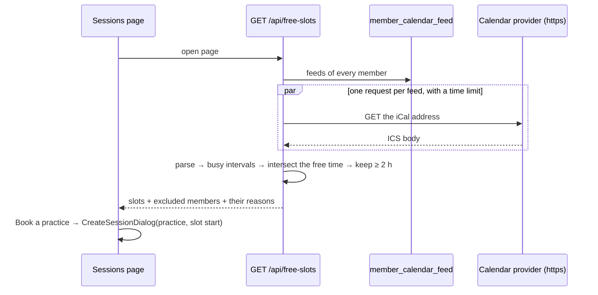

# The band sees the next two-hour slots when every member is free, and books a practice in one tap

## Perspectives confronted

- [x] **Client / business**: the operator chose "practices created from the free-slot button" as the measure of success, over "fewer messages in the group chat" and "every member connected a calendar" (2026-10-02).
- [x] **Product**: the operator ratified the time windows, the four-week period, the quarter-hour rounding, the exclusion of members without a calendar, and the rule that an all-day event blocks the evening unless it is marked "Free" (2026-10-02).
- [x] **Tech-lead**: the operator chose the secret iCal address over a service account or OAuth, a plain-text column over KMS encryption, per-stage database roles in the same pull request, and reading feeds when the page opens over a scheduled sync (2026-10-02).
- [x] **Developer**: the operator required the pull request to be proven in its preview against fake calendars, which makes fixture feeds part of the feature (2026-10-02).
- [x] **Designer**: the operator placed the calculation in a block at the top of the Sessions page rather than on a new page (2026-10-02).

## Why

Booking a practice today takes a round of messages in the group chat until every member has answered. Each member already keeps a calendar, so the application can read those calendars and propose the evenings that work for everyone.

- **Output metric:** the share of each month's practices that were created from a free slot. It is read from the new `session.origin` column, with no event pipeline needed.
- **Input metrics:** (1) the number of members with a connected calendar feed; (2) the free-slot block loads with every connected feed read; (3) one tap on a slot opens the practice form already filled in.
- **Gemba:** a bandmate asked for this feature in the band's own chat on 2026-10-02, which is first-hand evidence that the problem exists.

## Result

**Account page.** A new "Calendar" section has one field, "Secret iCal address", and a Save button. Once the address is saved, the field is replaced by "Calendar connected" with two buttons, "Replace" and "Remove". The address is never shown again, not even to its owner.

**Sessions page.** A new "Next free slots" block sits above the session list:

```
Next free slots · 2 h practice · next 4 weeks
Tue 14 Oct   19:15 – 23:00   [Book a practice]
Sat 18 Oct   14:00 – 17:30   [Book a practice]
Without Léa, who has no calendar · Tom's calendar needs reconnecting
```

"Book a practice" opens the existing `CreateSessionDialog` set to `practice`, with the date set to the slot's start. The rest of the flow is unchanged.

## Use cases / edge cases



**Happy path**

1. A member pastes the secret iCal address into the account page and saves it. The API accepts `https://` and `webcal://`, the second rewritten to `https://`.
2. A member opens Sessions. The API reads every feed and expands recurring events.
3. The API keeps the busy intervals inside the search windows: 18:00 to 24:00 on weekdays and 10:00 to 24:00 on Saturdays and Sundays, Europe/Paris time, from now to 28 days ahead.
4. It removes the busy time of every included member from the windows. It rounds each free interval's start up to the next quarter hour, and keeps the intervals that last at least 2 hours.
5. The block lists each free slot as its full interval, sorted by date.
6. "Book a practice" opens the practice form already filled in. Saving it creates a session with `origin = 'free_slot'`.

**Edge cases**

- An all-day event is busy for the whole day, unless it carries `TRANSP:TRANSPARENT` (marked "Free").
- A timed event marked `TRANSP:TRANSPARENT` or `STATUS:CANCELLED` is free.
- An invitation the member declined still counts as busy, because the feed does not reliably say which attendee is the member. This is out of scope.
- An event that crosses midnight blocks both evenings it touches.
- The days when the clocks change (last Sunday of March and of October) are computed in Europe/Paris time, not UTC.
- A member without a feed is excluded and named: "Without X, who has no calendar".
- When no member has a feed, the block shows an empty state that links to the account page.
- When no slot is found, the block says so and keeps the list of excluded members.
- Free time before now is cut off, so a slot that already started today begins at the next quarter hour.

**Error cases**

- The provider answers 401, 403, 404 or 410, which is what a reset or deleted address returns. The member is excluded and shown as "calendar needs reconnecting".
- A timeout, a 5xx, a body that does not parse, or a body over the size limit. The member is excluded and shown as "calendar unavailable right now". The other feeds still count.
- The address is not https, points to an IP literal or `localhost`, or redirects to one. It is rejected at save time and again when the feed is read (see the SSRF row below).

## Questions, Options and Decisions

| Question | Options | Decision (date) |
| --- | --- | --- |
| How do we read a calendar? | secret iCal address · Google service account · Google OAuth | Secret iCal address. It works with Google, iCloud and Outlook, and needs no Google project (2026-10-02). |
| How is the address stored? | plain column · KMS-encrypted column · one Secrets Manager secret per member | Plain text, in a **table of its own**: `member_calendar_feed`. A table of its own means the access rules work at table level, without depending on column-level `GRANT`, which the Aurora DSQL documentation neither confirms nor rules out (2026-10-02). |
| Who can read it? | every Lambda as `admin` (today) · one database role per stage schema | One role per stage. The migration runner creates it, maps it to that stage's API Lambda with `AWS IAM GRANT`, and grants it `USAGE` on its own schema plus table rights in it. API Lambdas move from `dsql:DbConnectAdmin` to `dsql:DbConnect`, and `admin` is left to the migration runner. This applies to every app on `DsqlSchema`: pragma, last-loop-lepin and banana-rush (2026-10-02). |
| Does a preview get prod's addresses? | clone them · block the table | `member_calendar_feed` goes into pragma's `tableBlocklist`, so previews start with no feeds (2026-10-02). |
| When are feeds read? | when the page opens · a scheduled sync | When the page opens. Nothing is stored except the address, and no scheduled job is added (2026-10-02). |
| ICS parsing | hand-written parser · `ical.js` · `node-ical` | A library, because expanding recurring events (`RRULE`, `EXDATE`, `RECURRENCE-ID`) and time zones is where a hand-written parser goes wrong. `ical.js`, see ADR-0025 (2026-10-02). |
| SSRF: the Lambda fetches an address a member typed | no guard · https only, port 443, no IP literal, at most 3 redirects each checked again, a size limit and a time limit | The guard. The Lambda runtime API listens on a loopback address, and only the https-on-443 rule keeps it out of reach (2026-10-02). |
| Measuring the output metric | an analytics event · a column on the session | A nullable `session.origin` column, set to `'free_slot'` by the button (2026-10-02). |
| Fake calendars in the preview | an external ICS host · ICS served by the preview's own test router | `/api/__test/calendar-feeds/:fixture.ics`, which exists only when `ALLOW_TEST_SEED=1`. The seed attaches fixture feeds to the fixture members. The fixtures are written relative to `now`, so a known slot always exists (2026-10-02). |

**Out of scope:** writing to calendars, invitations, sending reminders, practices longer than 2 hours, choosing a subset of members, per-member time windows, reading declined invitations, sessions that cross midnight.

## Architectural choices

| ADR | Decision | What it constrains downstream |
|---|---|---|
| [ADR-0023](../../../../adr/0023-one-database-role-per-stage-schema.md) | One database role per stage schema, mapped to the stage's API Lambda; Lambdas lose `DbConnectAdmin` | `DsqlSchema` takes the API's IAM role. The runner creates, grants and drops the role. The three `client.ts` files sign with `getDbConnectAuthToken` as the stage role. The Lambda deploys only after the schema custom resource. |
| [ADR-0024](../../../../adr/0024-calendar-feed-address-in-its-own-table.md) | The member's calendar feed address is a plain-text column in its own table, write-only through the API | No route returns the address. It never reaches a log. It is blocklisted from preview clones. |
| [ADR-0025](../../../../adr/0025-ical-js-parses-calendar-feeds.md) | `ical.js` parses the feeds | A new runtime dependency of `apps/pragma`, used only from `calendar-feeds/ics.adapter.ts`. |

## Changes

### Types / domain model

```ts
interface CalendarFeedStatus { memberId: string; state: 'connected' | 'absent' }
interface BusyInterval { start: Date; end: Date }
interface FreeSlot { start: Date; end: Date }
type FeedFailure = 'needs-reconnecting' | 'unavailable';
interface FreeSlotsResponse {
  slots: FreeSlot[];
  excludedMembers: { memberId: string; reason: 'no-calendar' | FeedFailure }[];
}
```

New vocabulary entries: **calendar feed** (a member's secret iCal address), **busy interval**, **free slot**. A free slot is not a practice: it becomes one only when somebody books it.

### Database changes

```sql
CREATE TABLE member_calendar_feed (member_id uuid PRIMARY KEY, address text NOT NULL, updated_at timestamptz NOT NULL);
ALTER TABLE session ADD COLUMN origin text;
```

`member_calendar_feed` is removed in the same transaction that deletes the member.

### Files to change

```
infra/cdk/src/constructs/dsql-schema.ts                 UPDATE: role per schema, API principal prop, grantConnect → DbConnect
infra/cdk/src/internal/migration-runner/index.ts        UPDATE: create/grant/revoke/drop the stage role
infra/cdk/src/internal/migration-runner/*.utils.ts      NEW: role-statement builders (100% coverage)
infra/cdk/src/constructs/{lambda-api,previewable-app}.ts UPDATE: wire the role name and the deploy dependency
apps/{pragma,last-loop-lepin,banana-rush}/api/src/database/client.ts  UPDATE: stage role + DbConnect token
apps/pragma/api/src/database/migrations/0015_calendar_feeds.sql       NEW
apps/pragma/api/src/calendar-feeds/                     NEW: controller, service, repository, schema, ics.adapter, feed-address.core
apps/pragma/api/src/free-slots/                         NEW: controller, service, free-slots.core (windows, intersection, rounding)
apps/pragma/api/src/sessions/sessions.schema.ts         UPDATE: origin
apps/pragma/api/src/__test/                             UPDATE: fixture feeds route + seed
apps/pragma/cdk/lib/stack.ts                            UPDATE: tableBlocklist += member_calendar_feed
apps/pragma/site/src/routes/account/AccountPage.tsx     UPDATE: Calendar section
apps/pragma/site/src/components/organisms/FreeSlotsPanel.tsx  NEW
apps/pragma/site/src/routes/sessions/SessionsPage.tsx   UPDATE: panel + prefilled dialog
apps/pragma/site/src/lib/queries/free-slots.queries.ts  NEW
apps/pragma/site/src/i18n/{en,fr}.json                  UPDATE
apps/pragma/VOCABULARY.md                               UPDATE
```

### Test strategy

- **Cores at 100%, mutation-tested:** `free-slots.core.ts` (windows across weekdays and weekends, both clock changes, events crossing midnight, rounding, the 2-hour minimum, cutting at now), `feed-address.core.ts` (https, webcal, IP literal, localhost, port) and the role-statement builders in `infra/cdk`.
- **Adapter tests** on ICS fixtures: a weekly `RRULE` with an `EXDATE`, a moved occurrence, an all-day event that is busy, an all-day event that is transparent, a cancelled event, an event in a non-Paris `TZID`.
- **Back-e2e** against local Postgres: `GET /api/free-slots` with feeds served by a stub; a 404 gives "needs reconnecting", a timeout gives "unavailable"; no response body ever contains `address`.
- **CDK:** a template assertion that no API Lambda policy contains `dsql:DbConnectAdmin`, and the `borso-shared` snapshot is unchanged.
- **Visual validation in the PR preview**, after `POST /api/__test/seed`: every happy-path step and every edge case above, at 375 px and 1280 px, through `scripts/argent.sh` for the tap on "Book a practice".
- This gate drives the input metrics only. A green run says nothing about the output metric.

## Production strategy

### Analytics

**Input metrics:** each month, the count of members with a feed, from `member_calendar_feed`. Each request logs `free_slots_computed` with the counts of feeds read, failed and excluded, and the duration, but never the addresses.

**Output metric:** once a month, the operator reads the share of the month's practices whose `origin = 'free_slot'`. If it stays near zero after every member has connected a calendar, the windows or the 2-hour length are wrong.

### Zero-defect strategy

- `CalendarFeedNeedsReconnecting` and `CalendarFeedUnavailable` are logged with `memberId` and the status code, never the address.
- The p90 of `free_slots_computed.duration` is watched in the CloudWatch logs. Its threshold is set from the first measurements and is not guessed here.
- A database authentication failure after the role cutover makes the whole API return 5xx. The preview deploy runs the same role path as production, so it fails first, before the merge.
